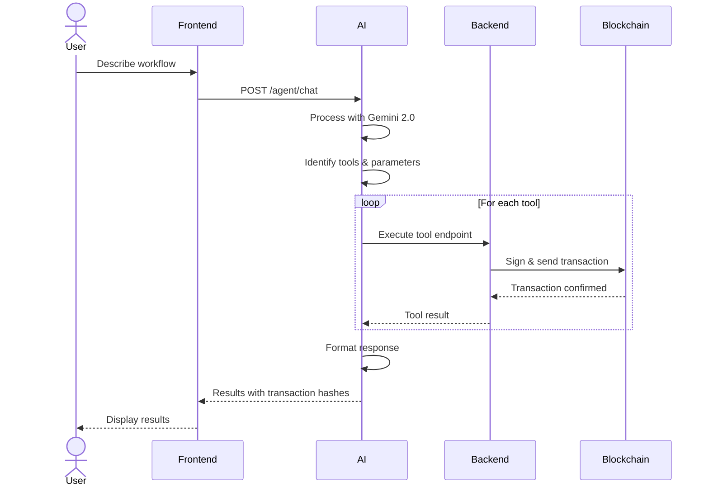

# BlockOps

## Introduction

**BlockOps** is a no-code AI-powered platform that enables users to build, deploy, and interact with blockchain agents on Arbitrum Sepolia. The platform combines a visual drag-and-drop workflow builder with AI-powered natural language processing, allowing users to create sophisticated blockchain automation workflows without writing any code.

The platform supports blockchain operations including **ERC-20 token deployment, ERC-721 NFT collection deployment, token transfers, and more**. All operations are powered by Arbitrum Stylus smart contracts and integrated with Gemini 2.0 Flash AI for intelligent agent interactions.

> **Note:** This is a complete full-stack application including frontend (Next.js), backend API (Express.js), AI agent services (FastAPI), and smart contracts (Rust/Stylus).

## Resources

* **Live Demo**: [https://blockops.vercel.app/](https://blockops.vercel.app/)
* **Demo Video**: [Watch on Google Drive](https://drive.google.com/drive/folders/137-DEv4MkspcmfuAN-ETsxpGMqzmZeZl?usp=sharing)
* **Payment Contract**: [View on Arbiscan](https://sepolia.arbiscan.io/address/0x185eba222e50dedae23a411bbbe5197ed9097381)

### Key Technologies

- **Frontend**: Next.js 15, React 19, TypeScript, Tailwind CSS, React Flow
- **Backend**: Express.js, ethers.js v6
- **AI Services**: FastAPI, Google Gemini 2.0 Flash
- **Blockchain**: Arbitrum Sepolia, Stylus (Rust WASM contracts)
- **Authentication**: Privy Auth
- **Database**: Supabase (PostgreSQL)

---

## How to Use

Getting started with BlockOps is simple! Follow these steps:

1. **Visit** [https://blockops.vercel.app/](https://blockops.vercel.app/)
2. **Sign In** with Web3 wallet using Privy authentication
3. **Create or Import Agent Wallet** 
   - Create a new agent wallet (automatically generated)
   - Or import your own wallet using a private key

4. **Build Your Agent** - Choose your preferred method:
   
   **Option A: AI-Powered Generation**
   - Describe your agent in natural language
   - Gemini 2.0 Flash AI generates the complete workflow for you
   - AI automatically selects and configures the right tools
   
   **Option B: Visual Builder**
   - Drag and drop blockchain tools onto the canvas
   - Connect tools to create your workflow
   - Configure parameters for each tool
   - Use React Flow for visual workflow management

5. **Save Your Agent** to your Supabase database

6. **Interact with Your Agent**:
   - **UI Chat Interface**: Chat with your agent using natural language
   - **API Integration**: Use REST API calls with your unique API key
   - For premium features, payments are handled via x402 protocol with USDC escrow

7. **Execute Blockchain Actions** seamlessly on Arbitrum Sepolia

That's it! You've created your first BlockOps agent without writing a single line of code!

---

## Table of Contents

1. [Platform Architecture](#platform-architecture)
2. [System Components](#system-components)
   - [Frontend](#frontend)
   - [Backend API](#backend-api)
   - [AI Agent Service](#ai-agent-service)
   - [Workflow Generator](#workflow-generator)
3. [Available Blockchain Tools](#available-blockchain-tools)
4. [Smart Contract Implementations](#smart-contract-implementations)
5. [Setup & Installation](#setup--installation)
6. [Environment Configuration](#environment-configuration)
7. [API Documentation](#api-documentation)

---

## Platform Architecture

### High-Level Architecture Diagram

```mermaid
graph TB
    subgraph "User Layer"
        U[👤 User Browser]
        UI[🖥️ Next.js Frontend<br/>Port: 3000]
    end
    
    subgraph "Authentication & Database"
        PRIVY[🔐 Privy Auth]
        SUPA[🗄️ Supabase Database]
    end
    
    subgraph "Backend Services"
        AI[🤖 AI Agent Backend<br/>FastAPI - Port 8000]
        BK[⚙️ Blockchain Backend<br/>Express - Port 3000]
        WF[🔄 Workflow Generator<br/>FastAPI - Port 8001]
    end
    
    subgraph "Blockchain Layer"
        ARB[🔗 Arbitrum Sepolia<br/>Chain ID: 421614]
    end
    
    subgraph "Smart Contracts"
        TF[📝 Token Factory<br/>Stylus Contract]
        NF[🎨 NFT Factory<br/>Stylus Contract]
        PE[💰 Payment Escrow<br/>x402 Protocol]
        USDC[💵 USDC Token]
    end
    
    U -->|User Actions| UI
    UI <-->|Authentication| PRIVY
    UI <-->|Data Storage| SUPA
    UI -->|AI Chat/Generate| AI
    UI -->|Workflow Build| WF
    AI -->|Tool Execution| BK
    BK -->|Deploy/Transfer| ARB
    ARB -->|Token Deploy| TF
    ARB -->|NFT Deploy| NF
    ARB -->|Payments| PE
    PE -->|USDC Escrow| USDC
```



### Data Flow Diagram



---

## System Components

### Frontend

**Technology Stack:**
- Next.js 15 (React 19)
- TypeScript
- React Flow (visual workflow builder)
- Tailwind CSS + Radix UI components
- Privy for authentication
- Supabase client for database

**Key Features:**
- Visual drag-and-drop workflow builder
- Node-based tool configuration
- Real-time AI chat interface
- Workflow saving and loading
- Agent management dashboard
- x402 protocol payment integration

**Main Pages:**
- `/` - Landing page
- `/agent-builder` - Visual workflow builder
- `/my-agents` - Agent management
- `/agent/:id` - Agent interaction interface
- `/payment-demo` - Payment testing interface

**Port:** 3000 (development)

### Backend API

**Technology Stack:**
- Express.js
- ethers.js v6 for Ethereum interactions
- Axios for HTTP requests
- OpenAI/Gemini SDK for AI features

**Network:**
- Arbitrum Sepolia RPC: `https://sepolia-rollup.arbitrum.io/rpc`
- Explorer: `https://sepolia.arbiscan.io`
- Chain ID: 421614

**Key Responsibilities:**
- Blockchain interaction via ethers.js
- Smart contract deployment and interaction
- Token/NFT creation via Stylus factory contracts
- Transaction signing and broadcasting
- Contract ABI management

**Main Endpoints:**
- `/health` - Health check
- `/token/*` - ERC-20 token operations
- `/nft/*` - ERC-721 NFT operations
- `/transfer` - Token transfer operations
- `/price` - Token price fetching

**Port:** 3000 (default)

### AI Agent Service

**Technology Stack:**
- FastAPI (Python)
- Google Gemini 2.0 Flash
- httpx for async HTTP requests

**Key Features:**
- Natural language to blockchain action conversion
- Dynamic tool configuration based on workflow
- Function calling with Gemini AI
- Context-aware tool selection
- Sequential execution support

**Main Endpoints:**
- `POST /agent/chat` - Process natural language messages
- `GET /tools` - List available tools
- `GET /health` - Health check

**Port:** 8000 (default)

### Workflow Generator

**Technology Stack:**
- FastAPI (Python)
- Google Gemini 2.0 Flash

**Key Features:**
- Natural language to workflow conversion
- Structured JSON output with tool connections
- Tool validation and suggestion
- Sequential execution planning

**Main Endpoints:**
- `POST /create-workflow` - Generate workflow from description
- `GET /available-tools` - List available tools
- `GET /health` - Health check

**Port:** 8001 (default)

---

## Available Blockchain Tools

### 1. ERC-20 Token Deployment

**Description:** Deploy custom ERC-20 tokens on Arbitrum Sepolia using Stylus contracts written in Rust.

**Endpoint:** `POST /token/deploy`

**Parameters:**
- `name` - Token name (e.g., "MyToken")
- `symbol` - Token symbol (e.g., "MTK")
- `decimals` - Number of decimals (typically 18)
- `initialSupply` - Initial token supply
- `privateKey` - Deployer's private key

**Implementation:**
- Uses TokenFactory Stylus contract
- Deploys optimized WASM bytecode
- Automatically initializes token
- Returns token address and transaction hash

**Example Response:**
```json
{
  "success": true,
  "tokenAddress": "0x...",
  "transactionHash": "0x...",
  "explorerUrl": "https://sepolia.arbiscan.io/tx/0x..."
}
```

### 2. ERC-721 NFT Collection Deployment

**Description:** Create NFT collections with customizable metadata and automatic IPFS integration.

**Endpoint:** `POST /nft/deploy-collection`

**Parameters:**
- `name` - Collection name
- `symbol` - Collection symbol
- `baseUri` - Base URI for metadata
- `privateKey` - Deployer's private key

**Implementation:**
- Uses NFTFactory Stylus contract
- Supports batch minting
- IPFS metadata storage via Pinata
- Built with Rust for gas efficiency

**Example Response:**
```json
{
  "success": true,
  "collectionAddress": "0x...",
  "transactionHash": "0x...",
  "explorerUrl": "https://sepolia.arbiscan.io/address/0x..."
}
```

### 3. Token Transfer

**Description:** Transfer native ETH or ERC-20 tokens between addresses.

**Endpoint:** `POST /transfer`

**Parameters:**
- `privateKey` - Sender's private key
- `to` - Recipient address
- `amount` - Amount to transfer
- `tokenAddress` - (Optional) ERC-20 token address

**Implementation:**
- Native transfers use direct wallet transactions
- ERC-20 transfers use token contract's `transfer()` function
- Automatic gas estimation
- Transaction confirmation waiting

### 4. Token Price Fetching

**Description:** Fetch real-time cryptocurrency prices using AI-powered search.

**Endpoint:** `POST /price`

**Parameters:**
- `query` - Token symbol or natural language query

**Implementation:**
- Uses Gemini 2.0 with search capabilities
- Returns current price and market data
- Supports multiple cryptocurrencies

---

## Smart Contract Implementations

### TokenFactory (Stylus - Rust)

**Location:** `contract/token_factory/`

**Technology:** Arbitrum Stylus (Rust → WASM)

**Key Features:**
- Full ERC-20 standard implementation
- Gas-optimized WASM execution
- Factory pattern for easy deployment
- Customizable token parameters

**Main Functions:**
```rust
// Initialize new token
pub fn initialize(&mut self, name: String, symbol: String, decimals: u8, initial_supply: U256)

// Standard ERC-20 functions
pub fn transfer(&mut self, to: Address, amount: U256) -> bool
pub fn approve(&mut self, spender: Address, amount: U256) -> bool
pub fn transfer_from(&mut self, from: Address, to: Address, amount: U256) -> bool

// View functions
pub fn balance_of(&self, account: Address) -> U256
pub fn total_supply(&self) -> U256
pub fn allowance(&self, owner: Address, spender: Address) -> U256
```

**Build & Deploy:**
```bash
cd contract/token_factory
cargo stylus check
cargo stylus deploy --private-key=$PRIVATE_KEY
```

### NFTFactory (Stylus - Rust)

**Location:** `contract/nft_factory/`

**Technology:** Arbitrum Stylus (Rust → WASM)

**Key Features:**
- Full ERC-721 standard implementation
- Batch minting support
- Custom metadata URIs
- Gas-efficient WASM execution

**Main Functions:**
```rust
// Initialize collection
pub fn initialize(&mut self, name: String, symbol: String, base_uri: String)

// Minting
pub fn mint(&mut self, to: Address) -> U256
pub fn mint_batch(&mut self, to: Address, amount: U256)

// Standard ERC-721 functions
pub fn transfer_from(&mut self, from: Address, to: Address, token_id: U256)
pub fn approve(&mut self, to: Address, token_id: U256)
pub fn set_approval_for_all(&mut self, operator: Address, approved: bool)

// View functions
pub fn owner_of(&self, token_id: U256) -> Address
pub fn balance_of(&self, owner: Address) -> U256
pub fn token_uri(&self, token_id: U256) -> String
```

**Build & Deploy:**
```bash
cd contract/nft_factory
cargo stylus check
cargo stylus deploy --private-key=$PRIVATE_KEY
```

### PaymentEscrow (Solidity)

**Location:** `contract/payment-contracts/contracts/PaymentEscrow.sol`

**Contract Address:** `0x185eba222e50dedae23a411bbbe5197ed9097381`

**Technology:** Solidity + Hardhat

**Key Features:**
- x402 protocol implementation
- USDC escrow for premium features
- Automatic refunds on failure
- Authorization for backend execution
- Pausable functionality

**Main Functions:**
```solidity
// Create payment agreement
function createPayment(
    string memory agentId,
    string memory toolName,
    address token,
    uint256 amount
) external payable returns (bytes32)

// Execute payment (backend only)
function executePayment(bytes32 paymentId) external

// Refund payment (backend only)
function refundPayment(bytes32 paymentId) external

// Admin functions
function setSupportedToken(address token, bool supported) external onlyOwner
function setAuthorizedBackend(address backend, bool authorized) external onlyOwner
```

**Deploy:**
```bash
cd contract/payment-contracts
npx hardhat run scripts/deploy.js --network arbitrumSepolia
```

---

## Setup & Installation

### Prerequisites

- Node.js 18+ 
- Python 3.9+
- Rust (for Stylus contracts)
- npm or yarn
- Git

### Clone Repository

```bash
git clone <repository-url>
cd n8nrollup
```

### Frontend Setup

```bash
cd frontend
npm install
cp .env.example .env.local
# Edit .env.local with your configuration
npm run dev
```

Frontend will run on `http://localhost:3000`

### Backend Setup

```bash
cd backend
npm install
cp .env.example .env
# Edit .env with your configuration
npm run dev
```

Backend will run on `http://localhost:3000`

### AI Agent Backend Setup

```bash
cd AI_workflow_backend
pip install -r requirements.txt
cp .env.example .env
# Edit .env with your Gemini API key
uvicorn main:app --reload --port 8000
```

AI Agent service will run on `http://localhost:8000`

### Workflow Generator Setup

```bash
cd n8n_agent_backend
pip install -r requirements.txt
cp .env.example .env
# Edit .env with your Gemini API key
uvicorn main:app --reload --port 8001
```

Workflow Generator will run on `http://localhost:8001`

### Smart Contract Deployment

**Token Factory (Stylus):**
```bash
cd contract/token_factory
cargo stylus check
cargo stylus deploy --private-key-path=.env
```

**NFT Factory (Stylus):**
```bash
cd contract/nft_factory
cargo stylus check
cargo stylus deploy --private-key-path=.env
```

**Payment Contract (Solidity):**
```bash
cd contract/payment-contracts
npm install
npx hardhat run scripts/deploy.js --network arbitrumSepolia
```

---

## Environment Configuration

### Frontend (.env.local)

```env
# Supabase
NEXT_PUBLIC_SUPABASE_URL=your_supabase_url
NEXT_PUBLIC_SUPABASE_ANON_KEY=your_supabase_key

# Privy Authentication
NEXT_PUBLIC_PRIVY_APP_ID=your_privy_app_id

# Blockchain
NEXT_PUBLIC_RPC_URL=https://sepolia-rollup.arbitrum.io/rpc
NEXT_PUBLIC_CHAIN_ID=421614

# Payment Contract
NEXT_PUBLIC_PAYMENT_CONTRACT_ADDRESS=0x185eba222e50dedae23a411bbbe5197ed9097381
NEXT_PUBLIC_USDC_ADDRESS=your_usdc_token_address

# Backend URLs
NEXT_PUBLIC_BACKEND_URL=http://localhost:3000
NEXT_PUBLIC_AI_BACKEND_URL=http://localhost:8000
NEXT_PUBLIC_WORKFLOW_BACKEND_URL=http://localhost:8001

# Payment Backend
PAYMENT_BACKEND_PRIVATE_KEY=your_backend_private_key
JWT_SECRET=your_jwt_secret
```

### Backend (.env)

```env
# Server
PORT=3000

# Blockchain
ARBITRUM_SEPOLIA_RPC=https://sepolia-rollup.arbitrum.io/rpc
TOKEN_FACTORY_ADDRESS=your_token_factory_address
NFT_FACTORY_ADDRESS=your_nft_factory_address

# API Keys
GEMINI_API_KEY=your_gemini_api_key
OPENAI_API_KEY=your_openai_api_key
ETHERSCAN_API_KEY=your_etherscan_api_key
PINATA_API_KEY=your_pinata_api_key
PINATA_SECRET_KEY=your_pinata_secret_key
```

### AI Services (.env)

```env
# Gemini AI
GEMINI_API_KEY=your_gemini_api_key

# Backend URL
BACKEND_URL=http://localhost:3000
```

---

## API Documentation

### AI Agent Chat Endpoint

**POST** `/agent/chat`

Process natural language messages and execute blockchain actions.

**Request:**
```json
{
  "user_message": "Deploy a token called MyToken with symbol MTK",
  "tools": ["deploy_erc20", "transfer", "mint_nft"],
  "private_key": "0x..."
}
```

**Response:**
```json
{
  "message": "Token deployed successfully!",
  "results": {
    "tokenAddress": "0x...",
    "transactionHash": "0x...",
    "explorerUrl": "https://sepolia.arbiscan.io/tx/0x..."
  },
  "tool_used": "deploy_erc20"
}
```

### Workflow Generation Endpoint

**POST** `/create-workflow`

Generate workflow structure from natural language description.

**Request:**
```json
{
  "description": "Create a workflow that deploys a token and then transfers it to multiple addresses"
}
```

**Response:**
```json
{
  "workflow": {
    "nodes": [
      {
        "id": "1",
        "type": "agent",
        "data": { "label": "Start" }
      },
      {
        "id": "2",
        "type": "tool",
        "data": { 
          "tool": "deploy_erc20",
          "label": "Deploy Token"
        }
      },
      {
        "id": "3",
        "type": "tool",
        "data": { 
          "tool": "transfer",
          "label": "Transfer Tokens"
        }
      }
    ],
    "edges": [
      { "source": "1", "target": "2" },
      { "source": "2", "target": "3" }
    ]
  }
}
```

### Token Deployment Endpoint

**POST** `/token/deploy`

Deploy a new ERC-20 token using Stylus.

**Request:**
```json
{
  "name": "MyToken",
  "symbol": "MTK",
  "decimals": 18,
  "initialSupply": "1000000",
  "privateKey": "0x..."
}
```

**Response:**
```json
{
  "success": true,
  "tokenAddress": "0x...",
  "transactionHash": "0x...",
  "explorerUrl": "https://sepolia.arbiscan.io/tx/0x...",
  "tokenInfo": {
    "name": "MyToken",
    "symbol": "MTK",
    "decimals": 18,
    "totalSupply": "1000000000000000000000000"
  }
}
```

### NFT Collection Deployment Endpoint

**POST** `/nft/deploy-collection`

Deploy a new ERC-721 NFT collection using Stylus.

**Request:**
```json
{
  "name": "MyNFT Collection",
  "symbol": "MNFT",
  "baseUri": "ipfs://QmXxx/",
  "privateKey": "0x..."
}
```

**Response:**
```json
{
  "success": true,
  "collectionAddress": "0x...",
  "transactionHash": "0x...",
  "explorerUrl": "https://sepolia.arbiscan.io/address/0x..."
}
```

---

## Docker Support

The project includes Docker Compose configuration for easy deployment.

### Run All Services

```bash
docker-compose up -d
```

This will start:
- Frontend (Next.js) on port 3000
- Backend (Express) on port 3000
- AI Agent Backend (FastAPI) on port 8000
- Workflow Generator (FastAPI) on port 8001

### Individual Services

```bash
# Frontend only
docker-compose up frontend

# Backend only
docker-compose up backend

# AI services
docker-compose up ai-agent workflow-generator
```

---

## Project Structure

```
n8nrollup/
├── frontend/                 # Next.js frontend application
│   ├── app/                 # Next.js app directory
│   │   ├── agent-builder/  # Visual workflow builder
│   │   ├── my-agents/      # Agent management
│   │   └── api/            # API routes
│   ├── components/          # React components
│   ├── lib/                # Utilities and helpers
│   └── package.json
│
├── backend/                 # Express.js backend API
│   ├── controllers/         # Request handlers
│   ├── routes/             # API routes
│   ├── config/             # Configuration files
│   │   ├── abis.js        # Contract ABIs
│   │   └── constants.js   # Network constants
│   ├── utils/              # Utility functions
│   └── package.json
│
├── AI_workflow_backend/     # FastAPI AI agent service
│   ├── main.py             # Main FastAPI application
│   └── requirements.txt
│
├── n8n_agent_backend/       # FastAPI workflow generator
│   ├── main.py             # Main FastAPI application
│   └── requirements.txt
│
├── contract/                # Smart contracts
│   ├── token_factory/      # Stylus ERC-20 factory (Rust)
│   ├── nft_factory/        # Stylus ERC-721 factory (Rust)
│   └── payment-contracts/  # Payment escrow (Solidity)
│
├── docker-compose.yml       # Docker orchestration
├── README.md               # This file
└── WORKFLOW_DIAGRAM.md     # Detailed workflow diagrams
```

---

## Key Features

### 🤖 AI-Powered Workflow Generation
- Describe your blockchain workflow in natural language
- Gemini 2.0 Flash automatically generates the complete workflow
- Intelligent tool selection and parameter configuration

### 🎨 Visual Workflow Builder
- Drag-and-drop interface powered by React Flow
- Connect blockchain tools visually
- Real-time workflow validation
- Save and load workflows

### 🔗 Blockchain Integration
- Native support for Arbitrum Sepolia
- Gas-optimized Stylus smart contracts (Rust → WASM)
- ERC-20 and ERC-721 token deployment
- Transaction signing and broadcasting

### 💰 Payment System
- x402 protocol integration
- USDC escrow for premium features
- Automatic refunds on transaction failure
- Pay-per-use pricing model

### 🔐 Security
- Privy authentication (Web3 + Web2)
- Encrypted private key storage in Supabase
- Backend authorization for payment execution
- Transaction verification before payment release

### 📊 Agent Management
- Create multiple agents with different workflows
- API key generation for programmatic access
- Chat interface for natural language interaction
- Transaction history and analytics

---

## Contributing

We welcome contributions! Please follow these steps:

1. Fork the repository
2. Create a feature branch (`git checkout -b feature/AmazingFeature`)
3. Commit your changes (`git commit -m 'Add some AmazingFeature'`)
4. Push to the branch (`git push origin feature/AmazingFeature`)
5. Open a Pull Request

---

## License

This project is licensed under the MIT License - see the LICENSE file for details.

---

## Support

For support, please:
- Open an issue on GitHub
- Contact the development team
- Check the documentation in `WORKFLOW_DIAGRAM.md`

---

## Acknowledgments

- **Arbitrum** for Stylus technology
- **Google** for Gemini AI
- **Privy** for authentication infrastructure
- **Supabase** for database and backend services
- **Vercel** for hosting and deployment

---

**Built with ❤️ on Arbitrum Sepolia**
