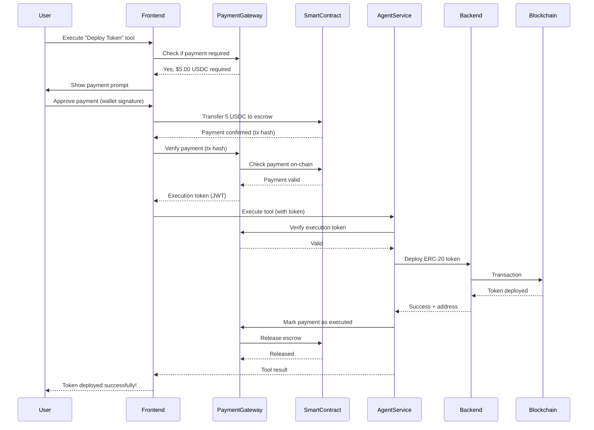
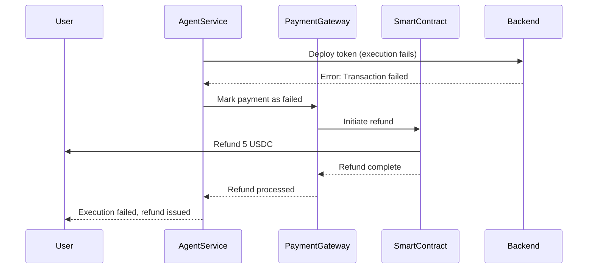

# x402 Payment Gating Implementation Guide for BlockOps

## 🎯 Quick Start Summary

**Goal:** Monetize BlockOps by gating premium tools and AI generations with crypto micropayments

**Key Features:**
- ✅ 3 free AI workflow generations per day
- ✅ Free basic tools (Transfer, Balance, Price)
- ✅ Pay-per-use for premium tools ($0.50 - $5.00)
- ✅ Smart contract escrow protection
- ✅ Automatic refunds on failures

**Timeline:** 10 days for MVP implementation

---

## 📋 Implementation Checklist

### Pre-Implementation (Day 0)
- [ ] Read entire guide
- [ ] Set up testnet wallet with funds
- [ ] Install MetaMask/wallet extension
- [ ] Get USDC on BlockOps testnet
- [ ] Create `.env` files from templates

### Phase 1: Foundation (Days 1-5)
**Day 1: Project Setup**
- [ ] Create feature branch `feature/x402-payment-integration`
- [ ] Install smart contract dependencies
- [ ] Install payment service dependencies
- [ ] Install frontend dependencies
- [ ] Create directory structure
- [ ] Configure environment variables

**Day 2: Smart Contracts**
- [ ] Create `PaymentEscrow.sol`
- [ ] Create deployment script
- [ ] Configure Hardhat
- [ ] Deploy to BlockOps testnet
- [ ] Verify contract on explorer
- [ ] Update `.env` with contract addresses

**Day 3: Database**
- [ ] Create migration SQL file
- [ ] Add `payments` table
- [ ] Add `pricing_config` table
- [ ] Add `user_usage` table
- [ ] Add `ai_generation_usage` table
- [ ] Add `payment_agreements` table
- [ ] Seed pricing data
- [ ] Create database functions

**Day 4: Payment Service Backend**
- [ ] Create Express.js service structure
- [ ] Implement payment service class
- [ ] Create payment routes
- [ ] Add payment middleware
- [ ] Test payment intent creation
- [ ] Test payment verification
- [ ] Deploy payment service

**Day 5: Frontend Foundation**
- [ ] Create payment context
- [ ] Implement usage tracking hooks
- [ ] Create payment utility functions
- [ ] Test context integration

### Phase 2: UI Components (Days 6-8)
**Day 6: Core Payment Components**
- [ ] Create `PaymentAgreementModal` component
- [ ] Create `PaymentModal` component
- [ ] Create `ToolPricingBadge` component
- [ ] Create `AIGenerationBadge` component
- [ ] Style and test all components

**Day 7: Integration**
- [ ] Update `WorkflowBuilder` with pricing badges
- [ ] Update `AIchatModal` with generation limits
- [ ] Add payment agreement flow
- [ ] Test AI generation limiting
- [ ] Test paid generation flow

**Day 8: Billing Dashboard**
- [ ] Create billing page
- [ ] Add payment history table
- [ ] Add usage statistics
- [ ] Add payment status tracking
- [ ] Test all billing features

### Phase 3: Testing & Launch (Days 9-10)
**Day 9: End-to-End Testing**
- [ ] Test free AI generations (1-3)
- [ ] Test payment agreement modal
- [ ] Test paid AI generation
- [ ] Test premium tool payments
- [ ] Test payment failures & refunds
- [ ] Test escrow functionality
- [ ] Load testing

**Day 10: Launch Preparation**
- [ ] Final security review
- [ ] Update documentation
- [ ] Create user guide
- [ ] Deploy to production
- [ ] Monitor first transactions
- [ ] Set up alerts

---

## Executive Summary

This guide outlines how to integrate x402 (HTTP 402 Payment Required) payment gating into BlockOps to monetize AI-powered blockchain automation services. By implementing x402, BlockOps can transform from a free platform into a **sustainable SaaS business** where users pay for premium agent executions, advanced tools, and API access.

---

## Table of Contents

1. [Why x402 for BlockOps?](#why-x402-for-blockops)
2. [High-Value Use Cases](#high-value-use-cases)
3. [System Architecture](#system-architecture)
4. [Implementation Phases](#implementation-phases)
5. [Technical Requirements](#technical-requirements)
6. [Database Schema Extensions](#database-schema-extensions)
7. [Payment Flow Design](#payment-flow-design)
8. [Pricing Models](#pricing-models)
9. [Smart Contract Integration](#smart-contract-integration)
10. [Security Considerations](#security-considerations)
11. [User Experience Design](#user-experience-design)
12. [Roadmap & Milestones](#roadmap--milestones)

---

## Why x402 for BlockOps?

### Current State
- **Free platform** with 10+ blockchain tools
- Users can create unlimited agents
- No revenue model
- High infrastructure costs (OpenAI API, RPC calls, server hosting)

### With x402 Integration
- **Pay-per-execution** model for premium tools
- **API rate limiting** with token-based payments
- **Tiered access** (free, pro, enterprise)
- **Automated settlement** via smart contracts
- **Sustainable revenue** stream

### Perfect Fit Rationale
1. **Blockchain-native platform** - Already handles wallet interactions
2. **Agent-based architecture** - Natural fit for per-execution payments
3. **API access** - Ideal for gating programmatic access
4. **Smart contract tools** - Can gate expensive operations (swaps, deployments)
5. **Real value delivery** - Users get immediate blockchain results

---

## High-Value Use Cases

### 1. **Premium Agent Executions** ⭐ HIGHEST VALUE
**What:** Charge per agent execution for complex workflows

**Why Valuable:**
- Users already interact with agents via UI/API
- Complex workflows (swap + transfer + airdrop) cost more
- AI inference + blockchain gas fees = real costs to cover

**Implementation:**
```
Free Tier: 10 executions/day
Pro Tier: Unlimited executions with $0.10/execution in USDC
Enterprise: Custom pricing
```

**Revenue Potential:** High - Most direct monetization

---

### 2. **Gated Blockchain Tools** ⭐⭐⭐
**What:** Free tools vs. Premium tools

**Why Valuable:**
- Some tools are more expensive to run (swaps, deployments)
- Users willing to pay for value-generating tools
- Clear ROI for users (e.g., token deployment = potential revenue)

**Tool Pricing Matrix:**
```
FREE TOOLS:
- Get Balance
- Fetch Price
- Wallet Analytics (basic)

PAID TOOLS ($0.50-$5.00 per execution):
- Deploy ERC-20 Token ($5.00)
- Deploy ERC-721 NFT ($5.00)
- Create DAO ($3.00)
- Token Swap ($1.00)
- Airdrop ($0.50 per batch)
- Advanced Wallet Analytics ($0.25)
```

**Revenue Potential:** Very High - Users understand value proposition

---

### 3. **API Access Tiers** ⭐⭐
**What:** Gate API access with crypto payments

**Why Valuable:**
- Developers building on top of BlockOps
- Automated systems need reliable access
- Prevents abuse and rate limiting

**Implementation:**
```
PUBLIC API (Free): 100 requests/day
STARTER API ($10/month in USDC): 10,000 requests/month
PRO API ($50/month in USDC): Unlimited requests
```

**Revenue Potential:** Medium - Targets developer segment

---

### 4. **AI Workflow Generation** ⭐⭐
**What:** Charge for AI-powered workflow builder

**Why Valuable:**
- Currently free but costs money (OpenAI API)
- Saves users significant time
- Unique value proposition

**Implementation:**
```
Free: 3 AI generations/day
Pro: Unlimited AI generations ($0.25/generation)
```

**Revenue Potential:** Medium - High usage feature

---

### 5. **Data Services & Analytics** ⭐
**What:** Premium wallet analytics and historical data

**Why Valuable:**
- Businesses need comprehensive analytics
- Historical data requires infrastructure
- Competitive intelligence value

**Implementation:**
```
Basic: Current balance only (free)
Advanced: Full transaction history ($2.00/query)
Enterprise: Real-time monitoring ($100/month)
```

**Revenue Potential:** Low-Medium - Niche use case

---

### 6. **Smart Contract Interaction as a Service**
**What:** Users pay to interact with ANY deployed contract

**Why Valuable:**
- Your Contract Explorer feature already exists
- Users need simple way to interact with contracts
- No coding required = premium value

**Implementation:**
```
Read functions: Free
Write functions: $0.10/transaction + gas fees
```

**Revenue Potential:** Medium - Depends on adoption

---

## System Architecture

### Current Architecture
```
User → Frontend → Agent Service → Backend API → Blockchain
                      ↓
                   OpenAI API
```

### With x402 Integration
```
User → Frontend → Payment Gateway → Agent Service → Backend API → Blockchain
         ↓              ↓                ↓
    Wallet Connect  PaymentVerifier   Tool Execution
                        ↓
                 Smart Contract
              (Payment Escrow/Settlement)
```

### Key New Components

1. **Payment Gateway Service** (Node.js/Express)
   - Validates payment requests
   - Checks on-chain payment status
   - Issues execution tokens
   - Rate limiting

2. **Payment Smart Contract** (Solidity)
   - Escrow payments
   - Verify payment completion
   - Automated refunds for failed executions
   - Multi-token support (USDC, native token, etc.)

3. **Payment Verification Middleware**
   - Intercepts all paid endpoint requests
   - Validates payment tokens
   - Logs usage for analytics

4. **Pricing Oracle**
   - Dynamic pricing based on tool complexity
   - Gas fee estimation
   - Token price conversion

---

## Implementation Phases

### Phase 1: Foundation (Weeks 1-2)
**Goal:** Set up payment infrastructure

**Tasks:**
1. Design payment smart contract
2. Deploy payment contract to BlockOps testnet
3. Create payment service (Express.js)
4. Add payment tables to database
5. Implement basic wallet connection for payments

**Deliverables:**
- ✅ Payment smart contract deployed
- ✅ Payment service API endpoints
- ✅ Database schema updated
- ✅ Basic payment UI component

---

### Phase 2: Tool Gating (Weeks 3-4)
**Goal:** Gate premium tools behind payments

**Tasks:**
1. Identify free vs. paid tools
2. Add payment middleware to Backend API
3. Update Agent Service to check payment status
4. Create pricing configuration
5. Add "Upgrade to Pro" UI prompts

**Deliverables:**
- ✅ 5+ tools gated behind payments
- ✅ Payment verification working
- ✅ Clear pricing displayed in UI
- ✅ User can purchase execution credits

---

### Phase 3: API Monetization (Weeks 5-6)
**Goal:** Monetize API access

**Tasks:**
1. Implement API key tiers (free/pro/enterprise)
2. Add rate limiting by tier
3. Create subscription smart contract
4. Build subscription management UI
5. API documentation updates

**Deliverables:**
- ✅ Tiered API access working
- ✅ Subscription payments automated
- ✅ Rate limiting enforced
- ✅ Developer dashboard with usage stats

---

### Phase 4: Advanced Features (Weeks 7-8)
**Goal:** Add subscription models and refund logic

**Tasks:**
1. Monthly subscription contracts
2. Automated refund for failed executions
3. Payment history dashboard
4. Multi-token payment support (USDC, USDT, native)
5. Invoice generation

**Deliverables:**
- ✅ Subscription model working
- ✅ Refund system operational
- ✅ User payment dashboard
- ✅ Multi-token support

---

### Phase 5: Analytics & Optimization (Weeks 9-10)
**Goal:** Track revenue and optimize pricing

**Tasks:**
1. Revenue analytics dashboard (admin)
2. User spending analytics
3. A/B test pricing models
4. Performance optimization
5. Documentation and tutorials

**Deliverables:**
- ✅ Admin revenue dashboard
- ✅ User insights
- ✅ Optimized pricing
- ✅ Complete documentation

---

## Technical Requirements

### Smart Contracts

#### 1. Payment Escrow Contract
```solidity
// PaymentEscrow.sol
contract PaymentEscrow {
    struct Payment {
        address user;
        uint256 amount;
        address token; // ERC-20 or native
        string agentId;
        string toolName;
        uint256 timestamp;
        bool executed;
        bool refunded;
    }
    
    mapping(bytes32 => Payment) public payments;
    
    function createPayment(string memory agentId, string memory toolName) 
        external payable returns (bytes32 paymentId);
        
    function verifyPayment(bytes32 paymentId) 
        external view returns (bool);
        
    function executePayment(bytes32 paymentId) 
        external onlyBackend;
        
    function refundPayment(bytes32 paymentId) 
        external onlyBackend;
}
```

#### 2. Subscription Manager Contract
```solidity
// SubscriptionManager.sol
contract SubscriptionManager {
    struct Subscription {
        address user;
        uint8 tier; // 0=free, 1=starter, 2=pro, 3=enterprise
        uint256 expiresAt;
        bool active;
    }
    
    mapping(address => Subscription) public subscriptions;
    
    function subscribe(uint8 tier) external payable;
    function isActiveSubscriber(address user) external view returns (bool);
    function getUserTier(address user) external view returns (uint8);
}
```

---

### Backend Services

#### Payment Gateway API (New Service)
**Tech Stack:** Express.js, ethers.js, Redis

**Endpoints:**
```typescript
POST   /api/payment/create           // Create payment intent
POST   /api/payment/verify           // Verify on-chain payment
GET    /api/payment/status/:id       // Check payment status
POST   /api/payment/refund/:id       // Request refund
GET    /api/payment/history           // User payment history

POST   /api/subscription/create      // Create subscription
GET    /api/subscription/status      // Check subscription status
POST   /api/subscription/cancel      // Cancel subscription
```

**Key Functions:**
```typescript
// Create payment intent
async function createPaymentIntent(
  userId: string,
  agentId: string,
  toolName: string,
  amount: string
): Promise<PaymentIntent>

// Verify payment on-chain
async function verifyPayment(
  paymentId: string
): Promise<boolean>

// Issue execution token (JWT)
async function issueExecutionToken(
  paymentId: string
): Promise<string>
```

---

#### Middleware Updates

**Agent Service Middleware:**
```typescript
// payment-middleware.ts
async function verifyPaymentToken(req, res, next) {
  const { api_key, payment_token, tool_name } = req.body;
  
  // Check if tool requires payment
  if (isPaidTool(tool_name)) {
    // Verify payment token
    const isValid = await paymentService.verifyToken(payment_token);
    
    if (!isValid) {
      return res.status(402).json({
        error: "Payment Required",
        message: `This tool requires payment of ${getToolPrice(tool_name)} USDC`,
        payment_url: `/api/payment/create?tool=${tool_name}`
      });
    }
  }
  
  next();
}
```

---

## Database Schema Extensions

### New Tables

#### `payments` Table
```sql
CREATE TABLE payments (
  id UUID PRIMARY KEY DEFAULT gen_random_uuid(),
  user_id TEXT NOT NULL REFERENCES users(id),
  agent_id UUID REFERENCES agents(id),
  payment_hash TEXT NOT NULL UNIQUE, -- On-chain tx hash
  payment_id TEXT NOT NULL UNIQUE, -- Off-chain reference
  amount DECIMAL(20, 6) NOT NULL,
  token_address TEXT NOT NULL, -- ERC-20 or 'native'
  token_symbol TEXT NOT NULL, -- USDC, ETH, etc.
  tool_name TEXT, -- Which tool was paid for
  status TEXT NOT NULL DEFAULT 'pending', -- pending, confirmed, executed, refunded, failed
  execution_token TEXT, -- JWT for execution
  transaction_hash TEXT, -- Result transaction hash
  refund_hash TEXT, -- Refund transaction hash
  created_at TIMESTAMP WITH TIME ZONE DEFAULT NOW(),
  confirmed_at TIMESTAMP WITH TIME ZONE,
  executed_at TIMESTAMP WITH TIME ZONE,
  expires_at TIMESTAMP WITH TIME ZONE
);

CREATE INDEX idx_payments_user_id ON payments(user_id);
CREATE INDEX idx_payments_payment_hash ON payments(payment_hash);
CREATE INDEX idx_payments_status ON payments(status);
CREATE INDEX idx_payments_created_at ON payments(created_at DESC);
```

#### `subscriptions` Table
```sql
CREATE TABLE subscriptions (
  id UUID PRIMARY KEY DEFAULT gen_random_uuid(),
  user_id TEXT NOT NULL REFERENCES users(id),
  tier TEXT NOT NULL, -- free, starter, pro, enterprise
  status TEXT NOT NULL DEFAULT 'active', -- active, cancelled, expired
  payment_token_address TEXT, -- Which token they paid with
  amount_per_period DECIMAL(20, 6),
  billing_period TEXT, -- monthly, yearly
  current_period_start TIMESTAMP WITH TIME ZONE NOT NULL,
  current_period_end TIMESTAMP WITH TIME ZONE NOT NULL,
  cancel_at_period_end BOOLEAN DEFAULT false,
  subscription_hash TEXT, -- On-chain subscription tx
  created_at TIMESTAMP WITH TIME ZONE DEFAULT NOW(),
  updated_at TIMESTAMP WITH TIME ZONE DEFAULT NOW()
);

CREATE INDEX idx_subscriptions_user_id ON subscriptions(user_id);
CREATE INDEX idx_subscriptions_status ON subscriptions(status);
CREATE INDEX idx_subscriptions_current_period_end ON subscriptions(current_period_end);
```

#### `pricing_config` Table
```sql
CREATE TABLE pricing_config (
  id UUID PRIMARY KEY DEFAULT gen_random_uuid(),
  tool_name TEXT NOT NULL UNIQUE,
  price_usdc DECIMAL(10, 2) NOT NULL,
  is_free BOOLEAN DEFAULT false,
  description TEXT,
  updated_at TIMESTAMP WITH TIME ZONE DEFAULT NOW()
);

-- Seed data
INSERT INTO pricing_config (tool_name, price_usdc, is_free, description) VALUES
  ('transfer', 0.00, true, 'Token transfers'),
  ('get_balance', 0.00, true, 'Check wallet balance'),
  ('fetch_price', 0.00, true, 'Fetch token prices'),
  ('swap', 1.00, false, 'Token swaps via DEX'),
  ('deploy_erc20', 5.00, false, 'Deploy ERC-20 token'),
  ('deploy_erc721', 5.00, false, 'Deploy NFT collection'),
  ('create_dao', 3.00, false, 'Create DAO'),
  ('airdrop', 0.50, false, 'Batch token airdrop'),
  ('deposit_yield', 0.25, false, 'Yield farming deposits'),
  ('wallet_analytics', 0.25, false, 'Advanced wallet analytics');
```

#### `api_rate_limits` Table
```sql
CREATE TABLE api_rate_limits (
  id UUID PRIMARY KEY DEFAULT gen_random_uuid(),
  user_id TEXT NOT NULL REFERENCES users(id),
  agent_id UUID REFERENCES agents(id),
  api_key TEXT NOT NULL,
  tier TEXT NOT NULL, -- free, starter, pro, enterprise
  requests_this_period INTEGER DEFAULT 0,
  period_start TIMESTAMP WITH TIME ZONE DEFAULT NOW(),
  period_end TIMESTAMP WITH TIME ZONE,
  max_requests INTEGER NOT NULL, -- Based on tier
  updated_at TIMESTAMP WITH TIME ZONE DEFAULT NOW()
);

CREATE INDEX idx_rate_limits_api_key ON api_rate_limits(api_key);
CREATE INDEX idx_rate_limits_user_id ON api_rate_limits(user_id);
```

---

## Payment Flow Design

### User Journey: Executing a Paid Tool



---

### Error Handling: Failed Execution



---

## Pricing Models

### Model 1: Pay-Per-Execution (Recommended for MVP)
**Best For:** Individual users, one-off tasks

**Pricing:**
- No subscription required
- Pay only when you use premium tools
- Clear per-tool pricing
- Instant execution after payment

**Pros:**
- Low barrier to entry
- Users pay for value received
- Easy to understand

**Cons:**
- Higher friction per use
- Lower lifetime value

---

### Model 2: Credit System
**Best For:** Power users, frequent executions

**How it works:**
- Buy credits in bulk ($10, $25, $50, $100)
- Get bonus credits (e.g., $50 = $55 in credits)
- Credits deducted per tool execution
- Credits never expire

**Pros:**
- Reduces payment friction
- Encourages bulk purchases
- Better unit economics

**Cons:**
- Requires credit management system
- Accounting complexity

---

### Model 3: Subscription Tiers (Recommended for Scale)
**Best For:** Businesses, developers, daily users

**Tiers:**

```
FREE TIER
- 10 agent executions/day
- Basic tools only
- 100 API requests/day
- Community support

STARTER ($10/month USDC)
- 500 executions/month
- All tools except DAO/Token deployment
- 10,000 API requests/month
- Email support

PRO ($50/month USDC)
- Unlimited executions
- All tools included
- Unlimited API requests
- Priority support
- Advanced analytics

ENTERPRISE (Custom)
- Dedicated infrastructure
- Custom integrations
- SLA guarantees
- Premium support
```

**Pros:**
- Predictable revenue
- Higher lifetime value
- Lower per-execution friction

**Cons:**
- Requires subscription management
- Churn risk

---

### Model 4: Hybrid (Best Long-Term)
**Combination:**
- Free tier with limits
- Pay-per-execution for occasional users
- Subscriptions for power users
- Enterprise custom pricing

---

## Smart Contract Integration

### Deployment Strategy

#### Contracts to Deploy

1. **PaymentEscrow.sol**
   - Handles pay-per-execution payments
   - Escrows funds until execution completes
   - Automated refunds

2. **SubscriptionManager.sol**
   - Manages monthly/yearly subscriptions
   - Tier verification
   - Grace periods

3. **PricingOracle.sol**
   - Dynamic pricing based on gas costs
   - Multi-token conversion rates
   - Admin controls

4. **TreasuryManager.sol**
   - Collects all payments
   - Distribution to team/treasury
   - Emergency withdrawals

---

### Example: Payment Escrow Implementation

```solidity
// SPDX-License-Identifier: MIT
pragma solidity ^0.8.20;

import "@openzeppelin/contracts/token/ERC20/IERC20.sol";
import "@openzeppelin/contracts/access/Ownable.sol";
import "@openzeppelin/contracts/security/ReentrancyGuard.sol";

contract PaymentEscrow is Ownable, ReentrancyGuard {
    
    struct Payment {
        address user;
        uint256 amount;
        address token;
        string agentId;
        string toolName;
        uint256 timestamp;
        bool executed;
        bool refunded;
    }
    
    mapping(bytes32 => Payment) public payments;
    mapping(address => bool) public authorizedBackends;
    address public treasury;
    
    event PaymentCreated(bytes32 indexed paymentId, address indexed user, uint256 amount, string toolName);
    event PaymentExecuted(bytes32 indexed paymentId, address indexed backend);
    event PaymentRefunded(bytes32 indexed paymentId, address indexed user, uint256 amount);
    
    constructor(address _treasury) {
        treasury = _treasury;
    }
    
    // User creates payment for tool execution
    function createPayment(
        string memory agentId,
        string memory toolName,
        address token,
        uint256 amount
    ) external payable nonReentrant returns (bytes32) {
        bytes32 paymentId = keccak256(
            abi.encodePacked(msg.sender, agentId, toolName, block.timestamp)
        );
        
        require(payments[paymentId].timestamp == 0, "Payment already exists");
        
        if (token == address(0)) {
            // Native token payment
            require(msg.value == amount, "Incorrect payment amount");
        } else {
            // ERC-20 payment
            require(
                IERC20(token).transferFrom(msg.sender, address(this), amount),
                "Token transfer failed"
            );
        }
        
        payments[paymentId] = Payment({
            user: msg.sender,
            amount: amount,
            token: token,
            agentId: agentId,
            toolName: toolName,
            timestamp: block.timestamp,
            executed: false,
            refunded: false
        });
        
        emit PaymentCreated(paymentId, msg.sender, amount, toolName);
        return paymentId;
    }
    
    // Backend confirms successful execution
    function executePayment(bytes32 paymentId) external nonReentrant {
        require(authorizedBackends[msg.sender], "Not authorized");
        Payment storage payment = payments[paymentId];
        require(payment.timestamp > 0, "Payment not found");
        require(!payment.executed, "Already executed");
        require(!payment.refunded, "Already refunded");
        
        payment.executed = true;
        
        // Transfer to treasury
        if (payment.token == address(0)) {
            (bool success, ) = treasury.call{value: payment.amount}("");
            require(success, "Transfer failed");
        } else {
            require(
                IERC20(payment.token).transfer(treasury, payment.amount),
                "Token transfer failed"
            );
        }
        
        emit PaymentExecuted(paymentId, msg.sender);
    }
    
    // Backend refunds failed execution
    function refundPayment(bytes32 paymentId) external nonReentrant {
        require(authorizedBackends[msg.sender], "Not authorized");
        Payment storage payment = payments[paymentId];
        require(payment.timestamp > 0, "Payment not found");
        require(!payment.executed, "Already executed");
        require(!payment.refunded, "Already refunded");
        
        payment.refunded = true;
        
        // Refund to user
        if (payment.token == address(0)) {
            (bool success, ) = payment.user.call{value: payment.amount}("");
            require(success, "Refund failed");
        } else {
            require(
                IERC20(payment.token).transfer(payment.user, payment.amount),
                "Token refund failed"
            );
        }
        
        emit PaymentRefunded(paymentId, payment.user, payment.amount);
    }
    
    // Admin functions
    function addAuthorizedBackend(address backend) external onlyOwner {
        authorizedBackends[backend] = true;
    }
    
    function removeAuthorizedBackend(address backend) external onlyOwner {
        authorizedBackends[backend] = false;
    }
    
    function updateTreasury(address newTreasury) external onlyOwner {
        treasury = newTreasury;
    }
    
    // View functions
    function verifyPayment(bytes32 paymentId) external view returns (bool) {
        Payment memory payment = payments[paymentId];
        return payment.timestamp > 0 && !payment.executed && !payment.refunded;
    }
}
```

---

## Security Considerations

### Critical Security Measures

1. **Payment Verification**
   - Always verify on-chain payment before execution
   - Never trust client-side payment claims
   - Use payment hashes, not user-provided IDs

2. **Execution Tokens**
   - Short-lived JWTs (5-10 minutes)
   - Single-use tokens
   - Signed with secure backend key

3. **Rate Limiting**
   - Per user, per IP, per API key
   - DDoS protection
   - Circuit breakers for abuse

4. **Smart Contract Security**
   - ReentrancyGuard on all payable functions
   - Ownable for admin functions
   - Pausable for emergency stops
   - Time-locks for critical updates

5. **Refund Logic**
   - Automated refunds for failed executions
   - Manual refund approval for disputes
   - Refund window (e.g., 24 hours)

6. **Privacy**
   - Don't log payment amounts in public logs
   - Encrypt sensitive payment data
   - GDPR compliance for EU users

---

## User Experience Design

### UI Components Implementation

#### 1. Payment Agreement Modal (First-Time Users)

Create `frontend/components/payment/payment-agreement-modal.tsx`:
```tsx
"use client"

import { useState } from 'react'
import {
  Dialog,
  DialogContent,
  DialogDescription,
  DialogFooter,
  DialogHeader,
  DialogTitle,
} from "@/components/ui/dialog"
import { Button } from "@/components/ui/button"
import { Alert, AlertDescription } from "@/components/ui/alert"
import { Checkbox } from "@/components/ui/checkbox"
import { Shield, Lock, RefreshCw, Zap } from "lucide-react"

interface PaymentAgreementModalProps {
  isOpen: boolean
  onAccept: () => Promise<void>
  onDecline: () => void
}

export function PaymentAgreementModal({ 
  isOpen, 
  onAccept, 
  onDecline 
}: PaymentAgreementModalProps) {
  const [agreed, setAgreed] = useState(false)
  const [loading, setLoading] = useState(false)

  const handleAccept = async () => {
    setLoading(true)
    try {
      await onAccept()
    } finally {
      setLoading(false)
    }
  }

  return (
    <Dialog open={isOpen} onOpenChange={(open) => !open && onDecline()}>
      <DialogContent className="max-w-2xl">
        <DialogHeader>
          <DialogTitle className="text-2xl flex items-center gap-2">
            <Shield className="h-6 w-6 text-blue-500" />
            Payment Terms & Conditions
          </DialogTitle>
          <DialogDescription>
            Continue enjoying BlockOps with transparent micro-transactions
          </DialogDescription>
        </DialogHeader>

        <div className="space-y-4 py-4">
          {/* Free Tier Benefits */}
          <div className="bg-green-50 dark:bg-green-900/20 p-4 rounded-lg">
            <h3 className="font-semibold text-green-900 dark:text-green-100 mb-2">
              ✨ Your Free Tier Includes:
            </h3>
            <ul className="space-y-1 text-sm text-green-800 dark:text-green-200">
              <li>• 3 AI-powered workflow generations per day</li>
              <li>• Unlimited use of basic tools (Transfer, Balance, Price Fetch)</li>
              <li>• 100 API requests per day</li>
              <li>• Full access to Contract Explorer</li>
            </ul>
          </div>

          {/* Premium Tools Info */}
          <div className="border rounded-lg p-4">
            <h3 className="font-semibold mb-3 flex items-center gap-2">
              <Zap className="h-5 w-5 text-yellow-500" />
              Premium Tools (After Free Limit)
            </h3>
            <div className="grid grid-cols-2 gap-3 text-sm">
              <div className="flex justify-between">
                <span>AI Generation (4+)</span>
                <span className="font-semibold">$0.25 USDC</span>
              </div>
              <div className="flex justify-between">
                <span>Token Swap</span>
                <span className="font-semibold">$1.00 USDC</span>
              </div>
              <div className="flex justify-between">
                <span>Deploy ERC-20</span>
                <span className="font-semibold">$5.00 USDC</span>
              </div>
              <div className="flex justify-between">
                <span>Deploy NFT</span>
                <span className="font-semibold">$5.00 USDC</span>
              </div>
              <div className="flex justify-between">
                <span>Create DAO</span>
                <span className="font-semibold">$3.00 USDC</span>
              </div>
              <div className="flex justify-between">
                <span>Airdrop</span>
                <span className="font-semibold">$0.50 USDC</span>
              </div>
            </div>
          </div>

          {/* How It Works */}
          <div className="space-y-2">
            <h3 className="font-semibold">How Payments Work:</h3>
            <div className="grid gap-3">
              <div className="flex gap-3 items-start">
                <Lock className="h-5 w-5 text-blue-500 mt-0.5" />
                <div>
                  <p className="font-medium text-sm">Escrow Protection</p>
                  <p className="text-sm text-muted-foreground">
                    Payments are held in smart contract escrow until tool execution completes
                  </p>
                </div>
              </div>
              <div className="flex gap-3 items-start">
                <RefreshCw className="h-5 w-5 text-green-500 mt-0.5" />
                <div>
                  <p className="font-medium text-sm">Automatic Refunds</p>
                  <p className="text-sm text-muted-foreground">
                    If execution fails, your payment is automatically refunded
                  </p>
                </div>
              </div>
              <div className="flex gap-3 items-start">
                <Shield className="h-5 w-5 text-purple-500 mt-0.5" />
                <div>
                  <p className="font-medium text-sm">Transparent Pricing</p>
                  <p className="text-sm text-muted-foreground">
                    You'll always see the exact cost before confirming any transaction
                  </p>
                </div>
              </div>
            </div>
          </div>

          {/* Terms Checkbox */}
          <Alert>
            <AlertDescription className="flex items-start gap-3">
              <Checkbox 
                checked={agreed} 
                onCheckedChange={(checked) => setAgreed(checked as boolean)}
                id="terms"
              />
              <label htmlFor="terms" className="text-sm cursor-pointer">
                I understand and agree to BlockOps payment terms. I acknowledge that premium 
                tools require payment after exceeding free tier limits, and I consent to 
                micro-transactions for continued service access.
              </label>
            </AlertDescription>
          </Alert>
        </div>

        <DialogFooter>
          <Button variant="outline" onClick={onDecline} disabled={loading}>
            Decline
          </Button>
          <Button 
            onClick={handleAccept} 
            disabled={!agreed || loading}
          >
            {loading ? "Processing..." : "Accept & Continue"}
          </Button>
        </DialogFooter>
      </DialogContent>
    </Dialog>
  )
}
```

#### 2. AI Generation Counter Badge

Create `frontend/components/payment/ai-generation-badge.tsx`:
```tsx
"use client"

import { Sparkles } from "lucide-react"
import { Badge } from "@/components/ui/badge"
import {
  Tooltip,
  TooltipContent,
  TooltipProvider,
  TooltipTrigger,
} from "@/components/ui/tooltip"
import { usePayment } from "@/lib/payment/payment-context"

export function AIGenerationBadge() {
  const { aiGenerationsLeft } = usePayment()

  const getColorClass = () => {
    if (aiGenerationsLeft === 0) return "bg-red-100 text-red-800 dark:bg-red-900/20 dark:text-red-400"
    if (aiGenerationsLeft === 1) return "bg-yellow-100 text-yellow-800 dark:bg-yellow-900/20 dark:text-yellow-400"
    return "bg-green-100 text-green-800 dark:bg-green-900/20 dark:text-green-400"
  }

  return (
    <TooltipProvider>
      <Tooltip>
        <TooltipTrigger asChild>
          <Badge variant="outline" className={`${getColorClass()} gap-1.5`}>
            <Sparkles className="h-3.5 w-3.5" />
            <span className="font-semibold">{aiGenerationsLeft}/3</span>
            <span className="text-xs">AI Gens</span>
          </Badge>
        </TooltipTrigger>
        <TooltipContent>
          <p>Free AI generations remaining today</p>
          {aiGenerationsLeft === 0 && (
            <p className="text-xs mt-1 text-muted-foreground">
              Additional generations: $0.25 USDC each
            </p>
          )}
        </TooltipContent>
      </Tooltip>
    </TooltipProvider>
  )
}
```

#### 3. Tool Pricing Badge

Create `frontend/components/payment/tool-pricing-badge.tsx`:
```tsx
"use client"

import { Badge } from "@/components/ui/badge"
import { DollarSign, Check } from "lucide-react"

interface ToolPricingBadgeProps {
  toolName: string
  price?: number
  isFree?: boolean
  size?: "sm" | "md" | "lg"
}

export function ToolPricingBadge({ 
  toolName, 
  price, 
  isFree = false,
  size = "md" 
}: ToolPricingBadgeProps) {
  const sizeClasses = {
    sm: "text-xs px-1.5 py-0.5",
    md: "text-sm px-2 py-1",
    lg: "text-base px-3 py-1.5"
  }

  if (isFree) {
    return (
      <Badge 
        variant="outline" 
        className={`bg-green-50 text-green-700 border-green-200 dark:bg-green-900/20 dark:text-green-400 ${sizeClasses[size]} gap-1`}
      >
        <Check className="h-3 w-3" />
        FREE
      </Badge>
    )
  }

  return (
    <Badge 
      variant="outline" 
      className={`bg-blue-50 text-blue-700 border-blue-200 dark:bg-blue-900/20 dark:text-blue-400 ${sizeClasses[size]} gap-1`}
    >
      <DollarSign className="h-3 w-3" />
      {price ? `$${price.toFixed(2)}` : 'PREMIUM'}
    </Badge>
  )
}
```

#### 4. Payment Confirmation Modal

Create `frontend/components/payment/payment-modal.tsx`:
```tsx
"use client"

import { useState, useEffect } from 'react'
import { ethers } from 'ethers'
import {
  Dialog,
  DialogContent,
  DialogDescription,
  DialogFooter,
  DialogHeader,
  DialogTitle,
} from "@/components/ui/dialog"
import { Button } from "@/components/ui/button"
import { Alert, AlertDescription } from "@/components/ui/alert"
import { Progress } from "@/components/ui/progress"
import { Shield, Loader2, CheckCircle, XCircle, Wallet } from "lucide-react"
import { useToast } from "@/hooks/use-toast"

interface PaymentModalProps {
  isOpen: boolean
  toolName: string
  price: number
  agentId: string
  onSuccess: (executionToken: string) => void
  onCancel: () => void
}

type PaymentStep = 'confirm' | 'approval' | 'payment' | 'verification' | 'complete' | 'error'

export function PaymentModal({ 
  isOpen, 
  toolName, 
  price, 
  agentId,
  onSuccess, 
  onCancel 
}: PaymentModalProps) {
  const [step, setStep] = useState<PaymentStep>('confirm')
  const [progress, setProgress] = useState(0)
  const [error, setError] = useState<string | null>(null)
  const [txHash, setTxHash] = useState<string | null>(null)
  const { toast } = useToast()

  const steps = {
    confirm: { label: 'Confirm Payment', progress: 0 },
    approval: { label: 'Approve USDC', progress: 25 },
    payment: { label: 'Processing Payment', progress: 50 },
    verification: { label: 'Verifying', progress: 75 },
    complete: { label: 'Complete', progress: 100 },
  }

  useEffect(() => {
    if (step in steps) {
      setProgress(steps[step as keyof typeof steps].progress)
    }
  }, [step])

  const handlePayment = async () => {
    try {
      setStep('approval')
      
      // Get provider and signer
      const provider = new ethers.BrowserProvider(window.ethereum)
      const signer = await provider.getSigner()
      
      // Create payment intent
      const response = await fetch(`${process.env.NEXT_PUBLIC_PAYMENT_SERVICE_URL}/api/payment/create`, {
        method: 'POST',
        headers: { 'Content-Type': 'application/json' },
        body: JSON.stringify({
          userId: 'current-user-id', // Get from auth context
          agentId,
          toolName,
          amount: price.toString()
        })
      })
      
      const { paymentId, tokenAddress, contractAddress } = await response.json()
      
      // Approve USDC
      const usdcContract = new ethers.Contract(
        tokenAddress,
        ['function approve(address spender, uint256 amount) returns (bool)'],
        signer
      )
      
      const amount = ethers.parseUnits(price.toString(), 6) // USDC has 6 decimals
      const approveTx = await usdcContract.approve(contractAddress, amount)
      await approveTx.wait()
      
      setStep('payment')
      
      // Create payment
      const paymentContract = new ethers.Contract(
        contractAddress,
        ['function createPayment(string agentId, string toolName, address token, uint256 amount) returns (bytes32)'],
        signer
      )
      
      const paymentTx = await paymentContract.createPayment(
        agentId,
        toolName,
        tokenAddress,
        amount
      )
      
      const receipt = await paymentTx.wait()
      setTxHash(receipt.hash)
      
      setStep('verification')
      
      // Verify payment and get execution token
      const verifyResponse = await fetch(`${process.env.NEXT_PUBLIC_PAYMENT_SERVICE_URL}/api/payment/verify`, {
        method: 'POST',
        headers: { 'Content-Type': 'application/json' },
        body: JSON.stringify({
          paymentHash: receipt.hash,
          paymentId
        })
      })
      
      const { executionToken } = await verifyResponse.json()
      
      setStep('complete')
      
      toast({
        title: "Payment Successful!",
        description: `You can now execute ${toolName}`,
      })
      
      setTimeout(() => {
        onSuccess(executionToken)
      }, 1000)
      
    } catch (err: any) {
      setError(err.message || 'Payment failed')
      setStep('error')
      toast({
        title: "Payment Failed",
        description: err.message,
        variant: "destructive"
      })
    }
  }

  return (
    <Dialog open={isOpen} onOpenChange={(open) => !open && onCancel()}>
      <DialogContent className="max-w-md">
        <DialogHeader>
          <DialogTitle className="flex items-center gap-2">
            {step === 'complete' ? (
              <CheckCircle className="h-5 w-5 text-green-500" />
            ) : step === 'error' ? (
              <XCircle className="h-5 w-5 text-red-500" />
            ) : (
              <Wallet className="h-5 w-5" />
            )}
            {step === 'complete' ? 'Payment Complete' : 'Confirm Payment'}
          </DialogTitle>
          <DialogDescription>
            {step === 'complete' 
              ? 'Your payment has been processed successfully'
              : 'Secure payment via smart contract escrow'
            }
          </DialogDescription>
        </DialogHeader>

        <div className="space-y-4 py-4">
          {/* Payment Details */}
          {step !== 'complete' && step !== 'error' && (
            <div className="bg-muted p-4 rounded-lg space-y-2">
              <div className="flex justify-between">
                <span className="text-sm text-muted-foreground">Tool</span>
                <span className="font-medium">{toolName}</span>
              </div>
              <div className="flex justify-between">
                <span className="text-sm text-muted-foreground">Price</span>
                <span className="text-lg font-bold">${price.toFixed(2)} USDC</span>
              </div>
              <div className="flex justify-between text-xs text-muted-foreground">
                <span>Network</span>
                <span>BlockOps Testnet</span>
              </div>
            </div>
          )}

          {/* Progress */}
          {step !== 'confirm' && step !== 'error' && step !== 'complete' && (
            <div className="space-y-2">
              <div className="flex items-center justify-between text-sm">
                <span className="text-muted-foreground">
                  {steps[step as keyof typeof steps]?.label}
                </span>
                <span className="font-medium">{progress}%</span>
              </div>
              <Progress value={progress} />
              <div className="flex items-center gap-2 text-sm text-muted-foreground">
                <Loader2 className="h-4 w-4 animate-spin" />
                <span>Processing transaction...</span>
              </div>
            </div>
          )}

          {/* Success State */}
          {step === 'complete' && (
            <div className="text-center space-y-4">
              <div className="flex justify-center">
                <div className="h-16 w-16 rounded-full bg-green-100 dark:bg-green-900/20 flex items-center justify-center">
                  <CheckCircle className="h-8 w-8 text-green-600" />
                </div>
              </div>
              <div>
                <p className="font-medium">Payment confirmed!</p>
                <p className="text-sm text-muted-foreground mt-1">
                  Proceeding to tool execution...
                </p>
              </div>
              {txHash && (
                <a 
                  href={`https://shannon-explorer.somnia.network/tx/${txHash}`}
                  target="_blank"
                  rel="noopener noreferrer"
                  className="text-xs text-blue-500 hover:underline"
                >
                  View transaction
                </a>
              )}
            </div>
          )}

          {/* Error State */}
          {step === 'error' && (
            <Alert variant="destructive">
              <XCircle className="h-4 w-4" />
              <AlertDescription>{error}</AlertDescription>
            </Alert>
          )}

          {/* Escrow Protection Notice */}
          {step === 'confirm' && (
            <Alert>
              <Shield className="h-4 w-4" />
              <AlertDescription>
                Your payment is protected by smart contract escrow. 
                If the tool execution fails, you'll be automatically refunded.
              </AlertDescription>
            </Alert>
          )}
        </div>

        <DialogFooter>
          {step === 'confirm' && (
            <>
              <Button variant="outline" onClick={onCancel}>
                Cancel
              </Button>
              <Button onClick={handlePayment}>
                Pay ${price.toFixed(2)} USDC
              </Button>
            </>
          )}
          {step === 'complete' && (
            <Button onClick={() => onSuccess('')} className="w-full">
              Continue
            </Button>
          )}
          {step === 'error' && (
            <>
              <Button variant="outline" onClick={onCancel}>
                Cancel
              </Button>
              <Button onClick={handlePayment}>
                Try Again
              </Button>
            </>
          )}
        </DialogFooter>
      </DialogContent>
    </Dialog>
  )
}
```

#### 5. Updated Workflow Builder with Payment Integration

Update `frontend/components/workflow-builder.tsx` to show pricing badges:

```tsx
// Add pricing badge to tool nodes
import { ToolPricingBadge } from "@/components/payment/tool-pricing-badge"
import { useEffect, useState } from "react"
import { supabase } from "@/lib/supabase"

// Inside WorkflowBuilder component, add pricing state
const [toolPricing, setToolPricing] = useState<Record<string, { price: number; isFree: boolean }>>({})

useEffect(() => {
  async function loadPricing() {
    const { data } = await supabase
      .from('pricing_config')
      .select('tool_name, price_usdc, is_free')
    
    if (data) {
      const pricingMap = data.reduce((acc, item) => {
        acc[item.tool_name] = { 
          price: item.price_usdc, 
          isFree: item.is_free 
        }
        return acc
      }, {} as Record<string, { price: number; isFree: boolean }>)
      setToolPricing(pricingMap)
    }
  }
  loadPricing()
}, [])

// Update ToolNode component to show pricing
function ToolNode({ data }: { data: any }) {
  const pricing = toolPricing[data.toolType] || { price: 0, isFree: true }
  
  return (
    <div className="relative">
      {/* Existing node content */}
      <div className="absolute top-2 right-2">
        <ToolPricingBadge 
          toolName={data.toolType}
          price={pricing.price}
          isFree={pricing.isFree}
          size="sm"
        />
      </div>
      {/* Rest of node */}
    </div>
  )
}
```

#### 6. AI Chat Modal with Generation Counter

Update `frontend/components/ai-chat-modal.tsx`:

```tsx
import { usePayment } from "@/lib/payment/payment-context"
import { PaymentAgreementModal } from "@/components/payment/payment-agreement-modal"
import { PaymentModal } from "@/components/payment/payment-modal"
import { AIGenerationBadge } from "@/components/payment/ai-generation-badge"
import { Sparkles } from "lucide-react"

export function AIChatModal({ isOpen, onClose, onWorkflowGenerated }) {
  const { 
    aiGenerationsLeft, 
    agreementRequired, 
    hasPaymentAgreement,
    acceptPaymentAgreement, 
    useAIGeneration 
  } = usePayment()
  
  const [showAgreement, setShowAgreement] = useState(false)
  const [showPayment, setShowPayment] = useState(false)
  const [prompt, setPrompt] = useState("")

  const handleGenerate = async () => {
    // Check if can use free generation
    const canUse = await useAIGeneration()
    
    if (!canUse) {
      if (!hasPaymentAgreement) {
        setShowAgreement(true)
      } else {
        setShowPayment(true)
      }
      return
    }
    
    // Proceed with free generation
    await generateWorkflow()
  }

  const handlePaidGeneration = async (executionToken: string) => {
    setShowPayment(false)
    // Generate workflow with paid token
    await generateWorkflow(executionToken)
  }

  return (
    <>
      <Dialog open={isOpen} onOpenChange={onClose}>
        <DialogContent className="max-w-3xl">
          <DialogHeader>
            <div className="flex items-center justify-between">
              <DialogTitle className="flex items-center gap-2">
                <Sparkles className="h-5 w-5" />
                AI Workflow Generator
              </DialogTitle>
              <AIGenerationBadge />
            </div>
            <DialogDescription>
              Describe your automation and AI will build the workflow
            </DialogDescription>
          </DialogHeader>

          {/* AI generation limit warning */}
          {aiGenerationsLeft === 0 && (
            <Alert className="border-yellow-200 bg-yellow-50 dark:bg-yellow-900/20">
              <AlertDescription>
                You've used your 3 free AI generations today. Additional 
                generations cost <strong>$0.25 USDC</strong> each.
              </AlertDescription>
            </Alert>
          )}

          {/* Rest of modal content */}
          <div className="space-y-4">
            <Textarea
              value={prompt}
              onChange={(e) => setPrompt(e.target.value)}
              placeholder="E.g., Create a workflow that swaps tokens and then airdrops them to a list of addresses..."
              rows={4}
            />
            
            <Button onClick={handleGenerate} className="w-full">
              {aiGenerationsLeft > 0 
                ? `Generate Workflow (${aiGenerationsLeft} free left)` 
                : 'Generate Workflow ($0.25 USDC)'
              }
            </Button>
          </div>
        </DialogContent>
      </Dialog>

      {/* Payment Agreement Modal */}
      <PaymentAgreementModal
        isOpen={showAgreement}
        onAccept={async () => {
          await acceptPaymentAgreement()
          setShowAgreement(false)
          setShowPayment(true)
        }}
        onDecline={() => {
          setShowAgreement(false)
          toast({
            title: "Agreement Required",
            description: "You must accept payment terms to use premium features",
            variant: "destructive"
          })
        }}
      />

      {/* Payment Modal for AI Generation */}
      <PaymentModal
        isOpen={showPayment}
        toolName="AI Workflow Generation"
        price={0.25}
        agentId="ai-generation"
        onSuccess={handlePaidGeneration}
        onCancel={() => setShowPayment(false)}
      />
    </>
  )
}
```

#### 7. User Billing Dashboard

Create `frontend/app/billing/page.tsx`:
```tsx
"use client"

import { useEffect, useState } from "react"
import { useAuth } from "@/lib/auth"
import { supabase } from "@/lib/supabase"
import { Card, CardContent, CardDescription, CardHeader, CardTitle } from "@/components/ui/card"
import { Badge } from "@/components/ui/badge"
import { Progress } from "@/components/ui/progress"
import { Tabs, TabsContent, TabsList, TabsTrigger } from "@/components/ui/tabs"
import { 
  DollarSign, 
  TrendingUp, 
  Activity, 
  Clock,
  CheckCircle,
  XCircle 
} from "lucide-react"
import { format } from "date-fns"

export default function BillingPage() {
  const { user } = useAuth()
  const [payments, setPayments] = useState([])
  const [stats, setStats] = useState({
    totalSpent: 0,
    successfulPayments: 0,
    failedPayments: 0,
    aiGenerationsUsed: 0
  })

  useEffect(() => {
    loadPaymentHistory()
    loadStats()
  }, [user])

  async function loadPaymentHistory() {
    const { data } = await supabase
      .from('payments')
      .select('*')
      .eq('user_id', user?.id)
      .order('created_at', { ascending: false })
      .limit(50)
    
    if (data) setPayments(data)
  }

  async function loadStats() {
    // Load payment stats
    const { data: paymentData } = await supabase
      .from('payments')
      .select('amount, status')
      .eq('user_id', user?.id)
    
    if (paymentData) {
      const totalSpent = paymentData
        .filter(p => p.status === 'executed')
        .reduce((sum, p) => sum + parseFloat(p.amount), 0)
      
      setStats(prev => ({
        ...prev,
        totalSpent,
        successfulPayments: paymentData.filter(p => p.status === 'executed').length,
        failedPayments: paymentData.filter(p => p.status === 'failed').length
      }))
    }

    // Load AI generation stats
    const { data: aiData } = await supabase
      .from('ai_generation_usage')
      .select('generation_count')
      .eq('user_id', user?.id)
      .single()
    
    if (aiData) {
      setStats(prev => ({
        ...prev,
        aiGenerationsUsed: aiData.generation_count
      }))
    }
  }

  return (
    <div className="container mx-auto py-8 space-y-8">
      <div>
        <h1 className="text-3xl font-bold">Billing & Usage</h1>
        <p className="text-muted-foreground">
          Track your spending and usage across BlockOps
        </p>
      </div>

      {/* Stats Cards */}
      <div className="grid gap-4 md:grid-cols-2 lg:grid-cols-4">
        <Card>
          <CardHeader className="flex flex-row items-center justify-between space-y-0 pb-2">
            <CardTitle className="text-sm font-medium">Total Spent</CardTitle>
            <DollarSign className="h-4 w-4 text-muted-foreground" />
          </CardHeader>
          <CardContent>
            <div className="text-2xl font-bold">
              ${stats.totalSpent.toFixed(2)}
            </div>
            <p className="text-xs text-muted-foreground">
              Across all tools
            </p>
          </CardContent>
        </Card>

        <Card>
          <CardHeader className="flex flex-row items-center justify-between space-y-0 pb-2">
            <CardTitle className="text-sm font-medium">Successful</CardTitle>
            <CheckCircle className="h-4 w-4 text-green-500" />
          </CardHeader>
          <CardContent>
            <div className="text-2xl font-bold">
              {stats.successfulPayments}
            </div>
            <p className="text-xs text-muted-foreground">
              Completed payments
            </p>
          </CardContent>
        </Card>

        <Card>
          <CardHeader className="flex flex-row items-center justify-between space-y-0 pb-2">
            <CardTitle className="text-sm font-medium">Failed/Refunded</CardTitle>
            <XCircle className="h-4 w-4 text-red-500" />
          </CardHeader>
          <CardContent>
            <div className="text-2xl font-bold">
              {stats.failedPayments}
            </div>
            <p className="text-xs text-muted-foreground">
              Automatic refunds
            </p>
          </CardContent>
        </Card>

        <Card>
          <CardHeader className="flex flex-row items-center justify-between space-y-0 pb-2">
            <CardTitle className="text-sm font-medium">AI Generations</CardTitle>
            <Activity className="h-4 w-4 text-muted-foreground" />
          </CardHeader>
          <CardContent>
            <div className="text-2xl font-bold">
              {stats.aiGenerationsUsed}/3
            </div>
            <p className="text-xs text-muted-foreground">
              Used today
            </p>
          </CardContent>
        </Card>
      </div>

      {/* Payment History */}
      <Card>
        <CardHeader>
          <CardTitle>Payment History</CardTitle>
          <CardDescription>
            All your transactions and tool executions
          </CardDescription>
        </CardHeader>
        <CardContent>
          <div className="space-y-4">
            {payments.map((payment: any) => (
              <div 
                key={payment.id}
                className="flex items-center justify-between p-4 border rounded-lg"
              >
                <div className="space-y-1">
                  <div className="flex items-center gap-2">
                    <p className="font-medium">{payment.tool_name}</p>
                    <Badge variant={
                      payment.status === 'executed' ? 'default' :
                      payment.status === 'pending' ? 'secondary' :
                      payment.status === 'refunded' ? 'outline' :
                      'destructive'
                    }>
                      {payment.status}
                    </Badge>
                  </div>
                  <p className="text-sm text-muted-foreground">
                    {format(new Date(payment.created_at), 'PPp')}
                  </p>
                </div>
                <div className="text-right">
                  <p className="font-bold">
                    ${parseFloat(payment.amount).toFixed(2)} {payment.token_symbol}
                  </p>
                  {payment.transaction_hash && (
                    <a 
                      href={`https://shannon-explorer.somnia.network/tx/${payment.transaction_hash}`}
                      target="_blank"
                      rel="noopener noreferrer"
                      className="text-xs text-blue-500 hover:underline"
                    >
                      View TX
                    </a>
                  )}
                </div>
              </div>
            ))}
            
            {payments.length === 0 && (
              <div className="text-center py-12 text-muted-foreground">
                <p>No payment history yet</p>
                <p className="text-sm mt-1">
                  Start using premium tools to see transactions here
                </p>
              </div>
            )}
          </div>
        </CardContent>
      </Card>
    </div>
  )
}
```

Continue to Security Considerations...

## Roadmap & Milestones

### Month 1: Foundation
- [ ] Design payment smart contracts
- [ ] Deploy contracts to testnet
- [ ] Build payment gateway service
- [ ] Update database schema
- [ ] Basic payment UI

**Success Metric:** First successful paid tool execution

---

### Month 2: Tool Gating
- [ ] Gate 5 premium tools
- [ ] Payment verification middleware
- [ ] Pricing configuration system
- [ ] User payment dashboard
- [ ] Refund system

**Success Metric:** 10 paying users

---

### Month 3: API Monetization
- [ ] API key tiers
- [ ] Rate limiting by tier
- [ ] Subscription contracts
- [ ] Subscription management UI
- [ ] Developer documentation

**Success Metric:** 5 API subscriptions

---

### Month 4: Scaling & Optimization
- [ ] Multi-token support (USDT, DAI)
- [ ] Dynamic pricing based on gas
- [ ] A/B test pricing models
- [ ] Revenue analytics dashboard
- [ ] Marketing materials

**Success Metric:** $1,000 MRR

---

### Month 5-6: Advanced Features
- [ ] Credit system
- [ ] Bulk discounts
- [ ] Referral program
- [ ] Enterprise custom pricing
- [ ] White-label solutions

**Success Metric:** $5,000 MRR

---

## Step-by-Step Implementation Guide

### 🚀 PHASE 1: SETUP & FOUNDATION (Days 1-5)

#### Day 1: Project Setup & Planning

**Step 1.1: Create Feature Branch**
```bash
cd /home/luffy/Projects/n8nrollup
git checkout -b feature/x402-payment-integration
```

**Step 1.2: Install Required Dependencies**
```bash
# Smart Contract Dependencies
cd contract
npm init -y
npm install --save-dev hardhat @nomicfoundation/hardhat-toolbox
npm install @openzeppelin/contracts dotenv

# Backend Dependencies (Payment Service)
mkdir payment-service
cd payment-service
npm init -y
npm install express ethers jsonwebtoken bcrypt cors dotenv
npm install --save-dev typescript @types/node @types/express ts-node nodemon

# Frontend Dependencies
cd ../../frontend
npm install @web3modal/wagmi wagmi viem @tanstack/react-query
npm install date-fns recharts
```

**Step 1.3: Create Project Structure**
```bash
# Create directory structure
mkdir -p contract/payment-contracts/contracts
mkdir -p contract/payment-contracts/scripts
mkdir -p contract/payment-contracts/test
mkdir -p payment-service/src/{controllers,middleware,models,services,utils}
mkdir -p frontend/components/payment
mkdir -p frontend/lib/payment
mkdir -p frontend/app/billing
```

**Step 1.4: Environment Configuration**

Create `.env` files:

```bash
# contract/payment-contracts/.env
PRIVATE_KEY=your_deployer_private_key
BLOCKOPS_RPC_URL=https://somnia-rpc-url
TREASURY_ADDRESS=your_treasury_wallet_address

# payment-service/.env
DATABASE_URL=your_supabase_url
JWT_SECRET=your_jwt_secret_key
PAYMENT_CONTRACT_ADDRESS=will_add_after_deployment
SUBSCRIPTION_CONTRACT_ADDRESS=will_add_after_deployment
RPC_URL=https://somnia-rpc-url
BACKEND_PRIVATE_KEY=your_backend_wallet_key

# frontend/.env.local
NEXT_PUBLIC_PAYMENT_SERVICE_URL=http://localhost:4000
NEXT_PUBLIC_PAYMENT_CONTRACT_ADDRESS=will_add_after_deployment
NEXT_PUBLIC_USDC_ADDRESS=0x... # USDC on BlockOps testnet
```

---

#### Day 2: Smart Contract Development

**Step 2.1: Create Payment Escrow Contract**

```bash
cd contract/payment-contracts
npx hardhat init
```

Create `contracts/PaymentEscrow.sol`:
```solidity
// SPDX-License-Identifier: MIT
pragma solidity ^0.8.20;

import "@openzeppelin/contracts/token/ERC20/IERC20.sol";
import "@openzeppelin/contracts/access/Ownable.sol";
import "@openzeppelin/contracts/security/ReentrancyGuard.sol";
import "@openzeppelin/contracts/security/Pausable.sol";

contract PaymentEscrow is Ownable, ReentrancyGuard, Pausable {
    
    struct Payment {
        address user;
        uint256 amount;
        address token;
        string agentId;
        string toolName;
        uint256 timestamp;
        bool executed;
        bool refunded;
    }
    
    mapping(bytes32 => Payment) public payments;
    mapping(address => bool) public authorizedBackends;
    mapping(address => bool) public supportedTokens;
    address public treasury;
    
    event PaymentCreated(bytes32 indexed paymentId, address indexed user, uint256 amount, string toolName);
    event PaymentExecuted(bytes32 indexed paymentId, address indexed backend);
    event PaymentRefunded(bytes32 indexed paymentId, address indexed user, uint256 amount);
    event TokenSupported(address indexed token, bool supported);
    
    constructor(address _treasury, address initialOwner) Ownable(initialOwner) {
        require(_treasury != address(0), "Invalid treasury address");
        treasury = _treasury;
    }
    
    function createPayment(
        string memory agentId,
        string memory toolName,
        address token,
        uint256 amount
    ) external payable nonReentrant whenNotPaused returns (bytes32) {
        bytes32 paymentId = keccak256(
            abi.encodePacked(msg.sender, agentId, toolName, block.timestamp, block.number)
        );
        
        require(payments[paymentId].timestamp == 0, "Payment already exists");
        
        if (token == address(0)) {
            require(msg.value == amount, "Incorrect payment amount");
        } else {
            require(supportedTokens[token], "Token not supported");
            require(
                IERC20(token).transferFrom(msg.sender, address(this), amount),
                "Token transfer failed"
            );
        }
        
        payments[paymentId] = Payment({
            user: msg.sender,
            amount: amount,
            token: token,
            agentId: agentId,
            toolName: toolName,
            timestamp: block.timestamp,
            executed: false,
            refunded: false
        });
        
        emit PaymentCreated(paymentId, msg.sender, amount, toolName);
        return paymentId;
    }
    
    function executePayment(bytes32 paymentId) external nonReentrant {
        require(authorizedBackends[msg.sender], "Not authorized");
        Payment storage payment = payments[paymentId];
        require(payment.timestamp > 0, "Payment not found");
        require(!payment.executed, "Already executed");
        require(!payment.refunded, "Already refunded");
        
        payment.executed = true;
        
        if (payment.token == address(0)) {
            (bool success, ) = treasury.call{value: payment.amount}("");
            require(success, "Transfer failed");
        } else {
            require(
                IERC20(payment.token).transfer(treasury, payment.amount),
                "Token transfer failed"
            );
        }
        
        emit PaymentExecuted(paymentId, msg.sender);
    }
    
    function refundPayment(bytes32 paymentId) external nonReentrant {
        require(authorizedBackends[msg.sender], "Not authorized");
        Payment storage payment = payments[paymentId];
        require(payment.timestamp > 0, "Payment not found");
        require(!payment.executed, "Already executed");
        require(!payment.refunded, "Already refunded");
        
        payment.refunded = true;
        
        if (payment.token == address(0)) {
            (bool success, ) = payment.user.call{value: payment.amount}("");
            require(success, "Refund failed");
        } else {
            require(
                IERC20(payment.token).transfer(payment.user, payment.amount),
                "Token refund failed"
            );
        }
        
        emit PaymentRefunded(paymentId, payment.user, payment.amount);
    }
    
    function addAuthorizedBackend(address backend) external onlyOwner {
        authorizedBackends[backend] = true;
    }
    
    function removeAuthorizedBackend(address backend) external onlyOwner {
        authorizedBackends[backend] = false;
    }
    
    function setSupportedToken(address token, bool supported) external onlyOwner {
        supportedTokens[token] = supported;
        emit TokenSupported(token, supported);
    }
    
    function updateTreasury(address newTreasury) external onlyOwner {
        require(newTreasury != address(0), "Invalid treasury");
        treasury = newTreasury;
    }
    
    function pause() external onlyOwner {
        _pause();
    }
    
    function unpause() external onlyOwner {
        _unpause();
    }
    
    function verifyPayment(bytes32 paymentId) external view returns (bool) {
        Payment memory payment = payments[paymentId];
        return payment.timestamp > 0 && !payment.executed && !payment.refunded;
    }
    
    function getPayment(bytes32 paymentId) external view returns (Payment memory) {
        return payments[paymentId];
    }
}
```

**Step 2.2: Create Deployment Script**

Create `scripts/deploy.js`:
```javascript
const hre = require("hardhat");

async function main() {
  const [deployer] = await hre.ethers.getSigners();
  console.log("Deploying contracts with account:", deployer.address);

  const treasury = process.env.TREASURY_ADDRESS || deployer.address;
  
  // Deploy PaymentEscrow
  const PaymentEscrow = await hre.ethers.getContractFactory("PaymentEscrow");
  const paymentEscrow = await PaymentEscrow.deploy(treasury, deployer.address);
  await paymentEscrow.waitForDeployment();
  
  const escrowAddress = await paymentEscrow.getAddress();
  console.log("PaymentEscrow deployed to:", escrowAddress);
  
  // Add USDC as supported token (replace with actual USDC address)
  const USDC_ADDRESS = process.env.USDC_ADDRESS || "0x...";
  await paymentEscrow.setSupportedToken(USDC_ADDRESS, true);
  console.log("USDC added as supported token");
  
  // Save deployment info
  const fs = require('fs');
  const deploymentInfo = {
    paymentEscrow: escrowAddress,
    treasury: treasury,
    deployer: deployer.address,
    network: hre.network.name,
    timestamp: new Date().toISOString()
  };
  
  fs.writeFileSync(
    './deployment-info.json',
    JSON.stringify(deploymentInfo, null, 2)
  );
  
  console.log("\n✅ Deployment complete!");
  console.log("Update your .env files with:");
  console.log(`PAYMENT_CONTRACT_ADDRESS=${escrowAddress}`);
}

main()
  .then(() => process.exit(0))
  .catch((error) => {
    console.error(error);
    process.exit(1);
  });
```

**Step 2.3: Deploy Contracts**
```bash
npx hardhat compile
npx hardhat run scripts/deploy.js --network blockops
```

---

#### Day 3: Database Schema Updates

**Step 3.1: Create Migration SQL File**

Create `frontend/migrations/001_add_payment_tables.sql`:

```sql
-- ============================================
-- PAYMENTS TABLE
-- ============================================
CREATE TABLE IF NOT EXISTS payments (
  id UUID PRIMARY KEY DEFAULT gen_random_uuid(),
  user_id TEXT NOT NULL REFERENCES users(id) ON DELETE CASCADE,
  agent_id UUID REFERENCES agents(id) ON DELETE SET NULL,
  payment_hash TEXT NOT NULL UNIQUE,
  payment_id TEXT NOT NULL UNIQUE,
  amount DECIMAL(20, 6) NOT NULL,
  token_address TEXT NOT NULL,
  token_symbol TEXT NOT NULL DEFAULT 'USDC',
  tool_name TEXT,
  status TEXT NOT NULL DEFAULT 'pending',
  execution_token TEXT,
  transaction_hash TEXT,
  refund_hash TEXT,
  error_message TEXT,
  created_at TIMESTAMP WITH TIME ZONE DEFAULT NOW(),
  confirmed_at TIMESTAMP WITH TIME ZONE,
  executed_at TIMESTAMP WITH TIME ZONE,
  expires_at TIMESTAMP WITH TIME ZONE
);

CREATE INDEX idx_payments_user_id ON payments(user_id);
CREATE INDEX idx_payments_payment_hash ON payments(payment_hash);
CREATE INDEX idx_payments_status ON payments(status);
CREATE INDEX idx_payments_created_at ON payments(created_at DESC);

-- ============================================
-- PRICING CONFIG TABLE
-- ============================================
CREATE TABLE IF NOT EXISTS pricing_config (
  id UUID PRIMARY KEY DEFAULT gen_random_uuid(),
  tool_name TEXT NOT NULL UNIQUE,
  price_usdc DECIMAL(10, 2) NOT NULL,
  is_free BOOLEAN DEFAULT false,
  description TEXT,
  icon TEXT,
  updated_at TIMESTAMP WITH TIME ZONE DEFAULT NOW()
);

-- Seed pricing data
INSERT INTO pricing_config (tool_name, price_usdc, is_free, description, icon) VALUES
  ('transfer', 0.00, true, 'Token transfers', 'arrow-right-left'),
  ('get_balance', 0.00, true, 'Check wallet balance', 'wallet'),
  ('fetch_price', 0.00, true, 'Fetch token prices', 'trending-up'),
  ('swap', 1.00, false, 'Token swaps via DEX', 'repeat'),
  ('deploy_erc20', 5.00, false, 'Deploy ERC-20 token', 'coins'),
  ('deploy_erc721', 5.00, false, 'Deploy NFT collection', 'image'),
  ('create_dao', 3.00, false, 'Create DAO', 'users'),
  ('airdrop', 0.50, false, 'Batch token airdrop', 'send'),
  ('deposit_yield', 0.25, false, 'Yield farming deposits', 'percent'),
  ('wallet_analytics', 0.25, false, 'Advanced wallet analytics', 'bar-chart')
ON CONFLICT (tool_name) DO NOTHING;

-- ============================================
-- USER USAGE TRACKING (FREE TIER LIMITS)
-- ============================================
CREATE TABLE IF NOT EXISTS user_usage (
  id UUID PRIMARY KEY DEFAULT gen_random_uuid(),
  user_id TEXT NOT NULL REFERENCES users(id) ON DELETE CASCADE,
  tool_name TEXT NOT NULL,
  usage_count INTEGER DEFAULT 0,
  period_start TIMESTAMP WITH TIME ZONE DEFAULT NOW(),
  period_end TIMESTAMP WITH TIME ZONE DEFAULT NOW() + INTERVAL '1 day',
  updated_at TIMESTAMP WITH TIME ZONE DEFAULT NOW(),
  UNIQUE(user_id, tool_name, period_start)
);

CREATE INDEX idx_user_usage_user_id ON user_usage(user_id);
CREATE INDEX idx_user_usage_period_end ON user_usage(period_end);

-- ============================================
-- AI GENERATION TRACKING
-- ============================================
CREATE TABLE IF NOT EXISTS ai_generation_usage (
  id UUID PRIMARY KEY DEFAULT gen_random_uuid(),
  user_id TEXT NOT NULL REFERENCES users(id) ON DELETE CASCADE,
  generation_count INTEGER DEFAULT 0,
  period_start TIMESTAMP WITH TIME ZONE DEFAULT NOW(),
  period_end TIMESTAMP WITH TIME ZONE DEFAULT NOW() + INTERVAL '1 day',
  last_generation_at TIMESTAMP WITH TIME ZONE,
  updated_at TIMESTAMP WITH TIME ZONE DEFAULT NOW(),
  UNIQUE(user_id, period_start)
);

CREATE INDEX idx_ai_usage_user_id ON ai_generation_usage(user_id);
CREATE INDEX idx_ai_usage_period_end ON ai_generation_usage(period_end);

-- ============================================
-- PAYMENT AGREEMENTS (USER CONSENT)
-- ============================================
CREATE TABLE IF NOT EXISTS payment_agreements (
  id UUID PRIMARY KEY DEFAULT gen_random_uuid(),
  user_id TEXT NOT NULL REFERENCES users(id) ON DELETE CASCADE,
  agreement_type TEXT NOT NULL DEFAULT 'micropayment',
  agreed_at TIMESTAMP WITH TIME ZONE DEFAULT NOW(),
  ip_address TEXT,
  user_agent TEXT,
  terms_version TEXT DEFAULT '1.0',
  is_active BOOLEAN DEFAULT true
);

CREATE INDEX idx_payment_agreements_user_id ON payment_agreements(user_id);
CREATE INDEX idx_payment_agreements_active ON payment_agreements(is_active);
```

**Step 3.2: Run Migration**
```bash
# Execute in Supabase SQL Editor or via CLI
psql $DATABASE_URL -f frontend/migrations/001_add_payment_tables.sql
```

---

#### Day 4: Payment Service Backend

**Step 4.1: Create Payment Service Structure**

Create `payment-service/src/server.ts`:
```typescript
import express from 'express';
import cors from 'cors';
import dotenv from 'dotenv';
import { paymentRoutes } from './routes/payment.routes';
import { errorHandler } from './middleware/error.middleware';

dotenv.config();

const app = express();
const PORT = process.env.PORT || 4000;

app.use(cors());
app.use(express.json());

// Routes
app.use('/api/payment', paymentRoutes);

// Health check
app.get('/health', (req, res) => {
  res.json({ status: 'ok', timestamp: new Date().toISOString() });
});

// Error handling
app.use(errorHandler);

app.listen(PORT, () => {
  console.log(`💰 Payment Service running on port ${PORT}`);
});
```

Create `payment-service/src/services/payment.service.ts`:
```typescript
import { ethers } from 'ethers';
import jwt from 'jsonwebtoken';
import { createClient } from '@supabase/supabase-js';

const supabase = createClient(
  process.env.DATABASE_URL!,
  process.env.SUPABASE_KEY!
);

const provider = new ethers.JsonRpcProvider(process.env.RPC_URL);
const wallet = new ethers.Wallet(process.env.BACKEND_PRIVATE_KEY!, provider);

const PAYMENT_CONTRACT_ABI = [
  "function createPayment(string agentId, string toolName, address token, uint256 amount) external payable returns (bytes32)",
  "function verifyPayment(bytes32 paymentId) external view returns (bool)",
  "function executePayment(bytes32 paymentId) external",
  "function refundPayment(bytes32 paymentId) external",
  "function getPayment(bytes32 paymentId) external view returns (tuple(address user, uint256 amount, address token, string agentId, string toolName, uint256 timestamp, bool executed, bool refunded))"
];

export class PaymentService {
  private contract: ethers.Contract;

  constructor() {
    this.contract = new ethers.Contract(
      process.env.PAYMENT_CONTRACT_ADDRESS!,
      PAYMENT_CONTRACT_ABI,
      wallet
    );
  }

  async createPaymentIntent(
    userId: string,
    agentId: string,
    toolName: string,
    amount: string
  ) {
    // Generate unique payment ID
    const paymentId = `pay_${Date.now()}_${Math.random().toString(36).substr(2, 9)}`;

    // Get token price
    const { data: pricing } = await supabase
      .from('pricing_config')
      .select('price_usdc')
      .eq('tool_name', toolName)
      .single();

    if (!pricing) {
      throw new Error('Tool not found');
    }

    // Store payment intent in database
    const { data, error } = await supabase
      .from('payments')
      .insert({
        user_id: userId,
        agent_id: agentId,
        payment_id: paymentId,
        amount: pricing.price_usdc,
        token_address: process.env.USDC_ADDRESS,
        token_symbol: 'USDC',
        tool_name: toolName,
        status: 'pending',
        expires_at: new Date(Date.now() + 15 * 60 * 1000) // 15 minutes
      })
      .select()
      .single();

    if (error) throw error;

    return {
      paymentId,
      amount: pricing.price_usdc,
      tokenAddress: process.env.USDC_ADDRESS,
      contractAddress: process.env.PAYMENT_CONTRACT_ADDRESS,
      expiresAt: data.expires_at
    };
  }

  async verifyPayment(paymentHash: string, paymentId: string) {
    // Verify transaction on-chain
    const tx = await provider.getTransaction(paymentHash);
    if (!tx) {
      throw new Error('Transaction not found');
    }

    await tx.wait();

    // Update payment status
    const { data, error } = await supabase
      .from('payments')
      .update({
        payment_hash: paymentHash,
        status: 'confirmed',
        confirmed_at: new Date().toISOString()
      })
      .eq('payment_id', paymentId)
      .select()
      .single();

    if (error) throw error;

    // Generate execution token (JWT)
    const executionToken = jwt.sign(
      {
        paymentId: data.payment_id,
        userId: data.user_id,
        toolName: data.tool_name,
        agentId: data.agent_id
      },
      process.env.JWT_SECRET!,
      { expiresIn: '10m' }
    );

    // Update with execution token
    await supabase
      .from('payments')
      .update({ execution_token: executionToken })
      .eq('id', data.id);

    return { executionToken, payment: data };
  }

  async verifyExecutionToken(token: string) {
    try {
      const decoded = jwt.verify(token, process.env.JWT_SECRET!) as any;

      // Check if payment exists and is confirmed
      const { data } = await supabase
        .from('payments')
        .select('*')
        .eq('payment_id', decoded.paymentId)
        .eq('status', 'confirmed')
        .single();

      return data ? true : false;
    } catch {
      return false;
    }
  }

  async markPaymentExecuted(paymentId: string, transactionHash: string) {
    const { data, error } = await supabase
      .from('payments')
      .update({
        status: 'executed',
        transaction_hash: transactionHash,
        executed_at: new Date().toISOString()
      })
      .eq('payment_id', paymentId)
      .select()
      .single();

    if (error) throw error;

    // Execute payment on-chain (release escrow)
    try {
      const paymentHashBytes = ethers.id(data.payment_hash);
      const tx = await this.contract.executePayment(paymentHashBytes);
      await tx.wait();
    } catch (err) {
      console.error('Failed to execute payment on-chain:', err);
    }

    return data;
  }

  async refundPayment(paymentId: string, reason: string) {
    const { data: payment } = await supabase
      .from('payments')
      .select('*')
      .eq('payment_id', paymentId)
      .single();

    if (!payment) throw new Error('Payment not found');

    // Refund on-chain
    const paymentHashBytes = ethers.id(payment.payment_hash);
    const tx = await this.contract.refundPayment(paymentHashBytes);
    const receipt = await tx.wait();

    // Update database
    await supabase
      .from('payments')
      .update({
        status: 'refunded',
        refund_hash: receipt.hash,
        error_message: reason
      })
      .eq('payment_id', paymentId);

    return { success: true, refundHash: receipt.hash };
  }
}
```

---

#### Day 5: Frontend Payment Components

**Step 5.1: Create Payment Context**

Create `frontend/lib/payment/payment-context.tsx`:
```tsx
"use client"

import { createContext, useContext, useState, useEffect } from 'react'
import { useAuth } from '@/lib/auth'
import { supabase } from '@/lib/supabase'

interface PaymentContextType {
  hasPaymentAgreement: boolean
  aiGenerationsLeft: number
  agreementRequired: boolean
  checkAIGenerations: () => Promise<number>
  acceptPaymentAgreement: () => Promise<void>
  useAIGeneration: () => Promise<boolean>
}

const PaymentContext = createContext<PaymentContextType | undefined>(undefined)

export function PaymentProvider({ children }: { children: React.ReactNode }) {
  const { user } = useAuth()
  const [hasPaymentAgreement, setHasPaymentAgreement] = useState(false)
  const [aiGenerationsLeft, setAiGenerationsLeft] = useState(3)
  const [agreementRequired, setAgreementRequired] = useState(false)

  useEffect(() => {
    if (user?.id) {
      checkPaymentAgreement()
      checkAIGenerations()
    }
  }, [user?.id])

  async function checkPaymentAgreement() {
    const { data } = await supabase
      .from('payment_agreements')
      .select('*')
      .eq('user_id', user!.id)
      .eq('is_active', true)
      .single()

    setHasPaymentAgreement(!!data)
  }

  async function checkAIGenerations() {
    const today = new Date()
    today.setHours(0, 0, 0, 0)

    const { data } = await supabase
      .from('ai_generation_usage')
      .select('generation_count')
      .eq('user_id', user!.id)
      .gte('period_end', new Date().toISOString())
      .single()

    const used = data?.generation_count || 0
    const remaining = Math.max(0, 3 - used)
    setAiGenerationsLeft(remaining)
    
    return remaining
  }

  async function acceptPaymentAgreement() {
    const { error } = await supabase
      .from('payment_agreements')
      .insert({
        user_id: user!.id,
        agreement_type: 'micropayment',
        terms_version: '1.0'
      })

    if (!error) {
      setHasPaymentAgreement(true)
      setAgreementRequired(false)
    }
  }

  async function useAIGeneration(): Promise<boolean> {
    const remaining = await checkAIGenerations()
    
    if (remaining > 0) {
      // Increment usage
      const today = new Date()
      today.setHours(0, 0, 0, 0)
      const tomorrow = new Date(today)
      tomorrow.setDate(tomorrow.getDate() + 1)

      await supabase.rpc('increment_ai_usage', {
        p_user_id: user!.id,
        p_period_start: today.toISOString(),
        p_period_end: tomorrow.toISOString()
      })

      setAiGenerationsLeft(remaining - 1)
      return true
    } else {
      setAgreementRequired(true)
      return false
    }
  }

  return (
    <PaymentContext.Provider
      value={{
        hasPaymentAgreement,
        aiGenerationsLeft,
        agreementRequired,
        checkAIGenerations,
        acceptPaymentAgreement,
        useAIGeneration
      }}
    >
      {children}
    </PaymentContext.Provider>
  )
}

export function usePayment() {
  const context = useContext(PaymentContext)
  if (!context) {
    throw new Error('usePayment must be used within PaymentProvider')
  }
  return context
}
```

Continue to next steps...

## Next Steps

### Immediate Actions (This Week)
1. ✅ Review this implementation guide with team
2. [ ] Decide on pricing model (recommend: hybrid)
3. [ ] Create project management board (GitHub Issues)
4. [ ] Assign team roles (smart contract dev, backend, frontend)
5. [ ] Set up testnet wallet with funds for deployment

### Week 1 Tasks
1. [ ] Write payment escrow smart contract
2. [ ] Write subscription manager smart contract
3. [ ] Deploy both contracts to BlockOps testnet
4. [ ] Create payment service scaffolding
5. [ ] Design payment UI mockups

### Success Metrics to Track
- **User Metrics:** Sign-ups, conversions, retention
- **Revenue Metrics:** MRR, ARPU, LTV, CAC
- **Usage Metrics:** Tool executions, API calls, payment success rate
- **Technical Metrics:** Payment verification speed, refund rate, uptime

---

## Conclusion

Implementing x402 payment gating transforms BlockOps from a **cost center into a revenue-generating business**. The phased approach allows you to:

1. **Start small** - Gate a few high-value tools
2. **Validate pricing** - Test what users will pay
3. **Scale gradually** - Add subscriptions and APIs
4. **Optimize continuously** - Improve based on data

**The most valuable implementation** is gating premium blockchain tools (token deployment, swaps, DAO creation) because:
- Clear value proposition
- Users understand the cost
- Immediate revenue
- Low implementation complexity

Start with **Phase 1 & 2** (tool gating) to see immediate ROI, then expand to API monetization and subscriptions.

---

## Resources & References

### Technical Documentation
- [EIP-402: HTTP 402 Payment Required](https://eips.ethereum.org/EIPS/eip-402)
- [OpenZeppelin Contracts](https://docs.openzeppelin.com/contracts/)
- [Ethers.js Documentation](https://docs.ethers.org/)

### Similar Projects
- [1Shot API](https://1shot.network/) - n8n blockchain integration
- [Chainlink Functions](https://chain.link/functions) - Paid API calls
- [The Graph](https://thegraph.com/) - Query pricing

### Community
- BlockOps Discord/Telegram for user feedback
- Developer forum for API users
- GitHub Discussions for open-source collaboration

---

**Last Updated:** November 23, 2025  
**Version:** 1.0  
**Status:** Ready for Implementation
